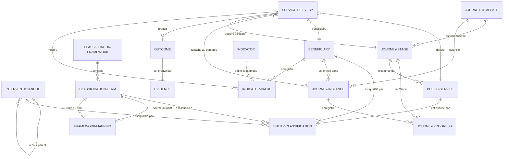

# DOCUMENTATION TECHNIQUE ET FONCTIONNELLE DÉTAILLÉE
## Plateforme d'Intelligence Territoriale (PIT vNext)

Ce document constitue la référence officielle décrivant l'architecture technique, le modèle de domaine (ontologie), les alignements sémantiques et les modules fonctionnels de la **Plateforme d'Intelligence Territoriale (PIT) vNext** de la Région wallonne.

---

## 🌐 1. Contexte et Vision Stratégique

La PIT est une plateforme d'intelligence territoriale conçue pour centraliser, qualifier et valoriser l'écosystème d'aides publiques et de services d'accompagnement à destination des entreprises wallonnes (TPE, PME, Startups, Grandes Entreprises).

### 1.1 Objectifs de la Refonte vNext
La version vNext adresse trois limitations structurelles de la solution MVP initiale :
1. **Flexibilité des Hiérarchies de Gouvernance** : Abandon du modèle linéaire figé (Program ➔ Project ➔ Action ➔ Activity) au profit d'un modèle d'arbre récursif de nœuds d'intervention (`InterventionNode`) régis par des patterns de validation (`InterventionPattern`). Cela permet de représenter n'importe quelle structure de politique publique (ex: S3, Circular Wallonia, EDIH, Plan de Relance).
2. **Recentrage de la Taxonomie DR-BEST** : Retrait de DR-BEST en tant qu'axe de structuration physique. DR-BEST est désormais traité comme une taxonomie transverse de qualification permettant d'auditer et d'indexer les services, capabilités et prestations.
3. **Introduction du Territorial Knowledge Graph** : Passage d'un catalogue relationnel plat à un graphe de connaissances sémantique interconnectant les entreprises, les opérateurs, les filières stratégiques (S3) et les impacts réels mesurés sur le territoire.

---

## 🕸️ 2. Le Graphe de Connaissances (Territorial Knowledge Graph)

Le cœur de la PIT vNext est structuré sous la forme d'un **Knowledge Graph**. Chaque entité économique ou réglementaire représente un nœud, relié à d'autres entités par des relations typées et pondérées.

### 2.1 Schéma Sémantique Global (Modèle Conceptuel)

### 2.2 Composants Structurants de la Phase 0

#### A. Les Business Views (Couche de Projection Sémantique)
Les **Business Views** agissent comme des filtres thématiques dynamiques au-dessus du graphe unique. Plutôt que de partitionner la base de données par programme, le système utilise des requêtes de classification pour projeter les cockpits métier.
* *Vue "S3"* : Filtre les nœuds d'innovation en fonction des filières S3 et calcule les indicateurs de transition technologique.
* *Vue "Circular Wallonia"* : Filtre les entreprises ayant des classifications d'économie circulaire et calcule la masse de matière vierge économisée et les réductions de CO2.

#### B. Le Framework Mapping (Interopérabilité des Taxonomies)
Permet de relier les différentes taxonomies entre elles via des types de prédicats (ex: `ENABLES`, `IMPLEMENTS`, `MAPS_TO`).
* *Exemple* : Mapper un terme de la taxonomie européenne d'IA (ex: `Computer Vision`) pour spécifier qu'il `ENABLES` (active) le domaine `S3-INDUSTRIE-FUTUR`.

#### C. L'Outcome & Evidence Framework (Mesure de la Valeur & ROI)
Il lie chaque acte d'accompagnement à un résultat concret (`Outcome`), prouvé par une pièce justificative (`Evidence`) et quantifié par une valeur d'indicateur (`IndicatorValue`).
* *Exemple* : Un service de diagnostic cyber génère un `Outcome` "Audit cyber complété", prouvé par un fichier PDF `audit_dupont_cyber.pdf` hébergé, avec un gain de `+2` sur l'axe **Cyber (C)** du profil de l'entreprise.

#### D. Le Data Source Framework (Gouvernance et Provenance)
Permet d'associer des métadonnées de provenance à n'est-ce qu'un nœud du graphe (`DataSourceMetadata`).
* *Champs clés* : `sourceSystem` (ex: BCE, Wallonie Entreprendre), `lastSyncedAt`, `authoritative` (booléen spécifiant si la source fait autorité pour bloquer les écritures manuelles conflictuelles).

#### E. La Semantic Identifier Strategy (Identifiants Uniques Globaux)
Chaque nœud d'intérêt intègre un champ `semanticId` unique au format URI.
* *Exemple* : `https://pit.wallonie.be/id/classification-term/nace-3832`, permettant une exposition et une conversion automatique en RDF/JSON-LD pour interagir avec GraphDB ou d'autres référentiels européens.

---

## 🧬 3. Spécifications Fonctionnelles des Cockpits

La PIT vNext se décline en cockpits thématiques dédiés aux différents profils utilisateurs (conseillers économiques, gestionnaires de programmes, décideurs politiques).

### 3.1 Cockpit des Programmes (`/programs`)
Permet de visualiser les structures d'intervention de l'action publique.
* **Fonctionnalités** :
  * Filtrage par Axe S3 et par dimension DR-BEST.
  * Drill-down dans l'arborescence récursive du programme.
  * Visualisation du budget alloué et des contributions d'impact du programme.
  * Accès au **Graphe Local de relations sémantiques** via ReactFlow pour comprendre les ponts d'impact.

### 3.2 Cockpit des Bénéficiaires (`/beneficiaries`)
Profil 360° des entreprises accompagnées.
* **Fonctionnalités** :
  * Liste filtrable par secteur NACE, par taille (TPE, PME, Startup, GE) et par province.
  * Visualisation du **Radar de Maturité DR-BEST** calculé en temps réel selon les prestations reçues.
  * Historique de la roadmap d'accompagnement de l'entreprise.
  * Suivi des parcours enrôlés (`JourneyInstance`).

### 3.3 Cockpit des Services (`/services`)
Catalogue unifié conforme au standard européen **CPSV-AP**.
* **Fonctionnalités** :
  * Recherche par mots-clés, filtrage par canal de diffusion (web, rendez-vous) et par niveau d'intervention (Individuel, Collectif, Deuxième ligne).
  * Alignements sémantiques associés : NACE, S3, Capabilités EDIH requises et fournies.
  * Sorties et résultats attendus (`Outputs` et `Outcomes`).

### 3.4 Cockpit des Parcours (`/journeys`)
Orchestration des chemins d'accompagnement PME.
* **Fonctionnalités** :
  * Édition de modèles de parcours (`JourneyTemplate`) divisés en étapes logiques (`JourneyStage`).
  * Attribution de services recommandés à chaque étape.
  * Déclencheurs dynamiques (`JourneyTrigger`) associés aux problématiques initiales des entreprises (`Challenge`).

### 3.5 Cockpit des Écosystèmes (`/ecosystems`)
Cartographie des clusters, pôles de compétitivité et hubs (ex: EDIH WallonIA, WalHub).
* **Fonctionnalités** :
  * Cartographie des acteurs rattachés (sirris, CETIC, AdN, WE).
  * Couverture géographique provinciale et filières S3 portées.
  * Liste des livrables de deuxième ligne (`SecondLineMission`) menés au bénéfice de l'écosystème.

---

## 🛠️ 4. Architecture Logique et Schéma de Base de Données

La persistance transactionnelle et sémantique repose sur **PostgreSQL** géré via le client ORM **Prisma**.

### 4.1 Mappings avec les Standards Européens (SEMIC)
Pour garantir l'interopérabilité transfrontalière et fédérale, les tables physiques de la PIT vNext s'alignent directement sur les vocabulaires contrôlés européens :

| Modèle Physique PIT | Vocabulaire SEMIC d'Alignement | Rôle de l'Alignement |
| :--- | :--- | :--- |
| `PublicService` | **CPSV-AP v3.0** (Core Public Service Vocabulary Application Profile) | Garantit que les attributs descriptifs (canal, public cible, coût) correspondent aux standards de l'UE. |
| `Organization` | **W3C ORG Ontology** | Représentation normalisée des administrations publiques et opérateurs territoriaux. |
| `Territory` | **W3C LOCN (Location Core Vocabulary)** | Structuration géographique des adresses, provinces et bassins économiques. |
| `Dataset` | **DCAT-AP** (Dataset Catalogue Application Profile) | Modélisation normalisée des actifs de données partagés et des flux. |
| `Capability` | **EDIH Capability Model / AI Competence Matrix** | Taxonomie harmonisée des compétences technologiques (TRL, IA, Cyber). |

### 4.2 Schéma Physique de la Base de Données (Prisma)
Le schéma comprend des tables additives clés pour persister la Phase 0 :
* `ClassificationFramework` & `ClassificationTerm` : Tables unifiées pour stocker les référentiels transversaux (DR-BEST, S3, NACE, TRL).
* `EntityClassification` : Table d'association générique reliant toute entité (`PublicService`, `Beneficiary`, `InterventionNode`) à un `ClassificationTerm`.
* `FrameworkMapping` : Table de graphe décrivant les ponts sémantiques entre termes (ex: `S3-NUM` ➔ `CAP-DIG-CYBER`).
* `ServiceDelivery` : Table enregistrant les prestations réelles fournies individuellement, liant un `Beneficiary`, un `PublicService`, et un `JourneyStage`.
* `Outcome`, `Evidence`, `Impact` & `OutcomeIndicator` : Tables assurant le suivi qualitatif, quantitatif et physique (fichiers) du ROI territorial.

---

## 🔮 5. Couche d'Intelligence Territoriale (Matchmaking & RAG)

### 5.1 Algorithme de Matchmaking Sémantique
Le Territorial Knowledge Graph calcule un **Score de Pertinence ($S$)** entre une PME ($B$) et un Service ($S_{vc}$) basé sur l'alignement de leurs classifications :
$$S(B, S_{vc}) = w_1 \cdot \text{MatchChallenges}(B, S_{vc}) + w_2 \cdot \text{GapDRBEST}(B, S_{vc}) + w_3 \cdot \text{FiliereS3}(B, S_{vc})$$
* **MatchChallenges** (Poids 40%) : 1 si le service résout un des défis actifs déclarés de la PME.
* **GapDRBEST** (Poids 40%) : Différence positive entre le niveau cible requis par le service et le niveau de maturité actuel de la PME sur les 6 axes. Les services ciblant les faiblesses sont prioritaires.
* **FiliereS3** (Poids 20%) : 1 si le service est assigné au maillon de la chaîne de valeur de l'entreprise.

### 5.2 Préparation aux Agents RAG (Retrieval-Augmented Generation)
Chaque entité du graphe de connaissances stockant ses relations logiques en base de données, la PIT vNext fournit des points de terminaison d'APIs structurées. Un modèle LLM externe peut interroger ces APIs pour récupérer un contexte sémantique propre et sans bruit (ex: *"Récupère les services d'accompagnement cyber de niveau individuel disponibles à Liège"*), éliminant ainsi tout risque d'hallucination lors de l'interaction avec le conseiller ou la PME.

---

## 🌐 6. Référentiels stables mobilisés par la PIT

La Plateforme d'Intelligence Territoriale s'appuie sur une couche de référentiels stables et d'alignement normatifs pour structurer ses connaissances et garantir l'interopérabilité des données régionales avec l'écosystème européen.

### 6.1 Cadre S3 / RIS3 & DIS
- **S3 / RIS3** : Cadre stratégique européen pour la spécialisation intelligente. La PIT intègre les taxonomies Eye@RIS3 et les guides de construction des priorités territoriales.
- **DIS Wallons (Domaines d'Innovation Stratégique)** : Déclinaisons opérationnelles wallonnes des priorités S3 (ex: Industrie du Futur, Circular Wallonia). Les DIS structurent l'arborescence des portefeuilles régionaux.
- **Marchés Applicatifs & Clusters Technopolis** : Issus de l'étude GTS3 Technopolis du 11 mai 2026, ces objets sont qualifiés comme des **proxys méthodologiques** dotés de limites (ex: contrainte KMeans de mono-positionnement). Ils requièrent une validation / triangulation par le Cabinet avant d'être promus comme référentiels définitifs.

### 6.2 Cadre Sémantique des Data Spaces
- **Common European Data Spaces** : Liste des 14 domaines sectoriels européens de référence (Agriculture, Health, Manufacturing, etc.) pour positionner les initiatives de partage de données.
- **DSSC Blueprint & IDSA RAM** : Fournissent les briques conceptuelles stables pour la gouvernance et l'interopérabilité technique des espaces de données (Connector, DataProduct, ClearingHouse, MetadataBroker, AccessPolicy, UsagePolicy).
- **Réglementation (Data Act, Data Governance Act)** : Modélisation des règles de confiance, d'altruisme des données et des intermédiaires certifiés.

### 6.3 Standards d'Interopérabilité & Vocabulaires
- **DCAT-AP** : Profil sémantique pour la description harmonisée des catalogues, datasets et data services, utilisé comme socle de la place de marché des données.
- **CPSV-AP** : Standard sémantique de description des services publics d'accompagnement et de financement (EDIH, aides de Wallonie Entreprendre, etc.).
- **NGSI-LD** : API et modèle sémantique de représentation de contexte dynamique territoriale.
- **SKOS & RDF / OWL** : Modèles du W3C pour formaliser et lier les concepts sémantiques entre référentiels (mappings EXACT_MATCH, RELATED, BROADER).
