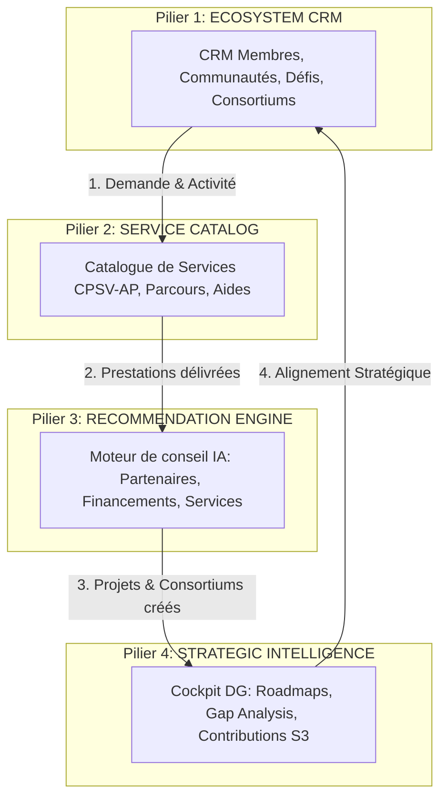

# STRATÉGIE ET REPOSITIONNEMENT GLOBAL : PIT 4 PILLARS

Ce document formalise le repositionnement stratégique de la **Plateforme d'Intégration Territoriale (PIT) Wallonie**. La PIT n'est plus envisagée comme une base de données sémantique passive ou un simple catalogue, mais comme une **plateforme métier collaborative quotidienne** reliant l'opérationnel terrain au pilotage stratégique régional.

---

## 🚀 LES 4 PILIERS DE LA PIT



### 1. PILIER 1 – ECOSYSTEM CRM
* **Objectif** : Outil de travail quotidien pour les chargés de mission et animateurs d'écosystèmes (clusters, pôles, EDIH, programmes).
* **Modules** : Membres, Communautés, Défis (Besoins), Compétences, Consortiums, Projets, Événements, Collaborations.
* **Fonctions clés** : Suivi des adhésions, cartographie des acteurs, détection des besoins technologiques, animation de groupes de travail, création assistée de consortiums.

### 2. PILIER 2 – TERRITORIAL SERVICE CATALOG
* **Objectif** : Référentiel unifié et fédéré de l'offre d'accompagnement et d'aides sur le territoire wallon.
* **Standards** : Modélisé sur **CPSV** / **CPSV-AP** (Common Public Service Vocabulary Application Profile), **D4WMO** (Digital for Wallonia Metadata Ontology) et **DCAT-AP** pour les données.
* **Modules** : Services publics et privés (ex: Diagnostic IA, Chèque Cybersécurité, Test Before Invest), Parcours de transformation, Aides et Financements, Acteurs de l'offre.

### 3. PILIER 3 – RECOMMENDATION ENGINE
* **Objectif** : Moteur intelligent de conseil et de courtage d'innovation.
* **Entrées sémantiques** : Profil du membre, secteur NACE, niveau de maturité (Digital, Cyber, IA, Export, Durabilité), défis déclarés, compétences répertoriées, historique des services consommés.
* **Recommandations** : Partenaires académiques ou industriels, experts, guichets de financements, événements de networking, communautés thématiques, consortiums en formation.

### 4. PILIER 4 – STRATEGIC INTELLIGENCE
* **Objectif** : Traduction automatique et transparente de l'activité opérationnelle en indicateurs stratégiques pour les décideurs (DG de pôle, SPW, Wallonie Entreprendre, AWEX, cabinets ministériels).
* **Règle absolue : AUCUN ENCODAGE MANUEL**.
* **Modules** : Missions stratégiques, Roadmaps, Portefeuilles d'innovation, KPIs de performance, Mesure d'impact, Gap Analysis (Détection des compétences manquantes ou des besoins non couverts par rapport aux priorités S3, Digital Wallonia ou Circular Wallonia).

---

## 👥 PERSONAS ET WORKSPACES DÉDIÉS

La PIT offre une expérience utilisateur segmentée en workspaces spécialisés selon le rôle de l'utilisateur :

| Persona | Rôle / Profil | Workspace | Objectif Principal |
| :--- | :--- | :--- | :--- |
| **Animateur de Pôle** | Chargé de mission, animateur de cluster (ex: BioWin, GreenWin). | **Workspace Animateur** | Animer sa communauté, détecter les besoins, assembler des consortiums et suivre les projets. |
| **Conseiller Innovation** | Conseiller EDIH, agent de Wallonie Entreprendre ou de l'AWEX. | **Workspace Conseiller** | Accompagner individuellement les PME, diagnostiquer leur maturité, prescrire des parcours. |
| **Dirigeant de PME** | Entrepreneur wallon cherchant à innover ou à se transformer. | **Workspace Entreprise** | Déclarer ses défis, recevoir des recommandations personnalisées et trouver des partenaires. |
| **Directeur Général (DG)** | Directeur de pôle, responsable SPW, administrateur public. | **Workspace DG / Exécutif** | Piloter la stratégie globale, analyser la gap analysis et mesurer l'impact territorial. |

---

## 🛠️ SPECIFICATIONS DES WORKSPACES

### A. WORKSPACE ANIMATEUR
* **Accueil (Mon Écosystème)** : Tableau de bord affichant les KPIs opérationnels de son pôle (membres actifs, nouveaux membres, consortiums créés, projets actifs, opportunités ouvertes).
* **Navigation** : Membres, Communautés, Défis, Compétences, Consortiums, Projets, Événements.
* **Flux opérationnel** : Un animateur ouvre la communauté "IA Santé", consulte les défis ouverts par les membres, lance l'outil de matching compétences, crée un consortium, l'associe à un appel Horizon Europe, et génère un projet.

### B. WORKSPACE CONSEILLER
* **Accueil (Mon Portefeuille Entreprises)** : Vue globale des dossiers d'entreprises en cours d'accompagnement.
* **Navigation** : Entreprises, Services, Parcours de transformation, Financements, Recommandations, Historique d'accompagnement.
* **Flux opérationnel** : Le conseiller réalise un diagnostic de maturité digitale avec une PME, le système génère un parcours recommandé (Diagnostic ➔ Plan d'action ➔ Services d'implémentation), puis le conseiller suit la livraison des livrables et la validation des outcomes.

### C. WORKSPACE ENTREPRISE
* **Accueil (Mon Parcours)** : Visualisation de sa feuille de route personnalisée.
* **Navigation** : Mon Profil, Mes Défis, Mes Services, Mes Financements, Mes Événements, Mes Recommandations, Mes Partenaires.
* **Flux opérationnel** : L'entreprise se connecte, déclare un défi de réduction des déchets, consulte les recommandations instantanées (Coaching Eco Design de GreenWin, aide Circular Wallonia), s'inscrit à un séminaire et contacte un partenaire suggéré.

### D. WORKSPACE DG / EXÉCUTIF
* **Accueil (Cockpit Exécutif)** : Mesure synthétique de l'impact des politiques publiques de l'écosystème.
* **Navigation** : Vision globale, Missions, Roadmaps, Portefeuilles d'innovation, Financements mobilisés, KPIs, Impacts, Gap Analysis.
* **Flux opérationnel** : Le DG examine l'alignement sur les priorités S3, identifie via la "Gap Analysis" une absence de compétences en hydrogène en Hainaut, et réoriente le catalogue de services ou les appels à projets en conséquence.

---

## 🔄 FLUX DE DONNÉES ET BOUCLE DE VALEUR

```
[Opérationnel Terrain : CRM Écosystème]
        │
        ▼ (Demande de service)
[Catalogue Territorial : CPSV-AP]
        │
        ▼ (Livraison & Accompagnement)
[Services Délivrés & Progression Parcours]
        │
        ▼ (Preuves de complétion)
[Outcomes Validés (ex: Hausse maturité)]
        │
        ▼ (Agrégation automatique)
[Pilotage Exécutif : Roadmaps & Impacts]
        │
        ▼ (Détection des manques / Besoins de l'écosystème)
[Gap Analysis Strategique]
        │
        ▼ (Re-recommandation de solutions)
[Moteur de Recommandation IA]
```

La force de cette architecture réside dans la **non-saisie** des données stratégiques :
1. Une activité CRM (ex: signature d'une collaboration, participation à un atelier) alimente automatiquement les indicateurs de la Roadmap.
2. La complétion d'un service (Pilier 2) valide un Outcome qui met à jour l'impact du Portefeuille (Pilier 4).
3. Le moteur de recommandation (Pilier 3) utilise l'historique et les écarts détectés (Gap Analysis) pour proposer l'action suivante la plus génératrice d'impact.
