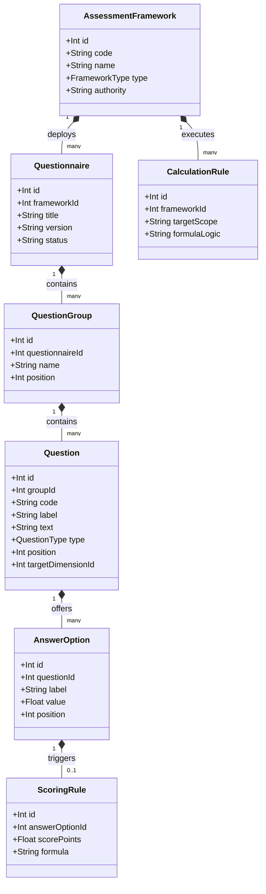
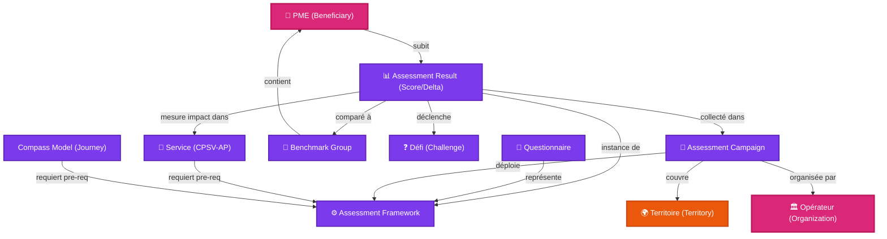

# 🌐 Plateforme d'Intelligence Territoriale (PIT) — Architecture Générique des Frameworks d'Évaluation

## Référentiel de Modélisation du Méta-Modèle d'Évaluation (Assessment Framework - v1.0)

Ce document définit l'architecture de référence permettant à la **Plateforme d'Intelligence Territoriale (PIT)** de gérer de manière générique et unifiée n'importe quel type d'évaluation, de questionnaire, de diagnostic sémantique, de score réglementaire, de campagne d'enquêtes ou de benchmark territorial, sans altération du schéma physique de la base de données.

---

## 🌟 1. Le Méta-Modèle d'Évaluation (`AssessmentFramework`)

Pour éviter la duplication de modèles de données à chaque nouveau programme (DMAT, Digiscore, NIS2, TRL...), la PIT s'appuie sur le concept racine d'**AssessmentFramework**. Ce méta-modèle encapsule tous les cas d'usage d'évaluation.

### Classification des Frameworks (`FrameworkType`)

1.  **`MaturityFramework`** : Mesure la progression continue sur des échelles d'excellence (ex : **DMAT** pour la Commission Européenne, **Digiscore** de l'AdN).
2.  **`ReadinessFramework`** : Évalue la préparation technique, commerciale ou industrielle avant de passer à l'action (ex : **TRL** pour Horizon Europe, **BRL** pour la mise sur le marché, **AI Readiness**).
3.  **`ComplianceFramework`** : Audite la conformité par rapport à des obligations légales, directives ou normes (ex : **NIS2** pour la cybersécurité industrielle, normes ISO).
4.  **`DiagnosticFramework`** : Analyse les besoins d'un bénéficiaire pour identifier des cas d'usage précis (ex : **TART IA** - outil d'aide à la décision IA).
5.  **`SatisfactionFramework`** : Recueille les retours des bénéficiaires suite aux interventions (ex : **Enquêtes de satisfaction EDIH**).
6.  **`ImpactFramework`** : Mesure l'impact à long terme des politiques publiques et subventions (ex : indicateurs de transition Circular Wallonia).
7.  **`BenchmarkFramework`** : Conçu spécifiquement pour positionner les statistiques d'une entreprise par rapport à ses pairs.
8.  **`SurveyFramework`** : Questionnaires généraux et études de marché territoriales.
9.  **`CustomFramework`** : Formulaires spécifiques d'opérateurs locaux.

---

## 📝 2. Modélisation Sémantique des Questionnaires

Le modèle découple le framework d'évaluation (la logique métier et réglementaire) du questionnaire physique (la structure d'affichage et de saisie).



### Rôle des Entités :
*   **`Questionnaire`** : Version active du formulaire d'évaluation rattachée à un framework.
*   **`QuestionGroup`** : Sections logiques d'un formulaire (ex : "Infrastructures", "Sécurité des terminaux").
*   **`Question`** : L'élément de saisie. Elle est rattachée à une dimension sémantique (`targetDimensionId` pointant vers la taxonomie *Capability Domains*).
*   **`AnswerOption`** : Choix disponibles (ex : "Oui", "Non", "Partiellement").
*   **`ScoringRule`** : Détermine le poids ou les points associés à une réponse (ex: "Oui" = 2.0, "Non" = 0.0).
*   **`CalculationRule`** : Formule de calcul pour agréger les points des questions en scores de dimensions et en scores globaux (ex: moyenne pondérée).

---

## 📢 3. Campagnes d'Évaluation (`AssessmentCampaign`)

La collecte de données est gérée par des **Campagnes d'Évaluation**. Une campagne définit un cadre temporel et opérationnel pour regrouper les évaluations.

*   *Attributs* : `code`, `name`, `startDate`, `endDate`, `status` (`PLANNED`, `ACTIVE`, `COMPLETED`, `ARCHIVED`).
*   *Liaisons de Gouvernance* :
    *   `Campaign ➔ AssessmentFramework` : Le framework utilisé pour la campagne (ex : DMAT).
    *   `Campaign ➔ Territory` : Limite géographique de la campagne (ex : province de Liège ou Wallonie complète).
    *   `Campaign ➔ Ecosystem` : L'écosystème régional coordinateur (ex : EDIH Wallonia).
    *   `Campaign ➔ Beneficiary` (Plusieurs) : Les entreprises cibles devant être évaluées.
    *   `Campaign ➔ Organization` (Plusieurs) : Les opérateurs chargés de mener les audits sur le terrain.

---

## 📊 4. Benchmarking Sémantique & Territorial

Le benchmarking permet de positionner instantanément les résultats d'une PME par rapport à des cohortes comparables.

### Entités du Sous-système de Benchmark :
1.  **`BenchmarkGroup`** : Cohorte de comparaison. Elle est définie dynamiquement par des critères ou de manière statique.
    *   *Exemple 1* : PME manufacturières wallonnes (Secteur NACE + Taille).
    *   *Exemple 2* : Entreprises de la Province de Luxembourg (Territoire).
    *   *Exemple 3* : Startups de l'écosystème BioWin (Écosystème).
2.  **`BenchmarkDimension`** : L'axe évalué (ex : dimension *Cybersécurité*).
3.  **`BenchmarkScore`** : Contient les statistiques consolidées de la cohorte pour un framework donné (Moyenne, Médiane, Écart-type, Centiles : 25%, 50%, 75%, 90%).

### Cas d'usage :
*   *Comparaison sectorielle* : "Votre score IA est supérieur à 72% des entreprises du secteur agroalimentaire."
*   *Comparaison territoriale* : "Positionnement cyber par rapport à la moyenne des entreprises du Hainaut."

---

## 🧠 5. Formalisation Conceptuelle : Capabilité, Évaluation & Maturité

Pour éviter les confusions sémantiques, le graphe de connaissances structure les concepts selon trois plans distincts :

1.  **`Capability` (Capabilité)** : Le domaine technologique ou métier concerné (le **"QUOI"**). C'est un concept abstrait et partagé (ex : *AI*, *Cyber*, *Data*, *Cloud*).
2.  **`Assessment` (Évaluation)** : Le processus physique de mesure (le **"COMMENT"**). C'est l'action d'auditer à l'aide d'un questionnaire (ex : réaliser le *Cyber Fundamentals* ou le *DMAT*).
3.  **`Maturity` (Maturité)** : Le résultat chiffré ou qualitatif à un instant donné (la **"VALEUR"**). C'est le score obtenu sur une échelle d'évaluation (ex : *Cyber = 4/5*, *AI = 2/5*).

### Exemple d'alignement complet :
*   `Capability Domain` = **Cybersécurité**
*   `Assessment Framework` = **Cyber Fundamentals (CCB)**
*   `Assessment Result` = **Échelon "Bronze"** (Maturité obtenue)

---

## 🗂️ 6. Taxonomie Transverse : PIT Capability Domains

Cette taxonomie constitue le **socle commun d'alignement sémantique** de la PIT. Toutes les questions, dimensions de frameworks spécifiques, services publics (CPSV-AP) et parcours sont reliés à cette taxonomie pour assurer le matchmaking.

```
📁 PIT Capability Domains
├── 🌐 Digitalisation (Digitalisation globale)
├── 📊 Données (Data Management, Open Data, Analytics)
├── 🤖 Intelligence Artificielle (Machine Learning, Vision, GenAI)
├── 🛡️ Cybersécurité (Sécurité infrastructures, NIS2, NIS)
├── ☁️ Cloud (Cloud Computing, architectures décentralisées)
├── ⚙️ Automatisation (RPA, robotisation de processus)
├── 🏭 Industrie 4.0 (OT, IoT industriel, Smart Manufacturing)
├── 💡 Innovation (R&D, Design Thinking, Innovation Readiness)
├── ♻️ Circularité (Éco-conception, Réemploi, Valorisation)
├── 🍃 Décarbonation (Transition énergétique, Empreinte CO2)
├── ✈️ Internationalisation (Exportation, marchés étrangers)
├── 💰 Financement (Levées de fonds, aides publiques, capital)
├── 🎓 Compétences (Capital humain, Upskilling, formations)
├── 🏛️ Gouvernance (Gestion d'entreprise, Compliance, NIS2)
└── 🛡️ Résilience (Continuité d'activité, gestion des risques)
```

*Exemple de mapping* : La dimension "Skills" du DMAT européen et la dimension "Readiness/Skills" du DR-BEST wallon pointent toutes deux sémantiquement vers le domaine transverse **Compétences**.

---

## 📈 7. Gestion Complexe des Scores & Historisation

Le modèle gère de multiples types de scores pour l'analyse décisionnelle territoriale :

*   **`Score`** : Valeur brute.
*   **`DimensionScore`** : Score calculé pour un axe sémantique (ex : Note de 3/5 en Data).
*   **`CompositeScore`** : Score calculé par agrégation pondérée de plusieurs sous-scores.
*   **`BenchmarkScore`** : Positionnement en centiles par rapport à un `BenchmarkGroup`.
*   **`TrendScore`** : Vecteur d'évolution calculé (Hausse, Baisse, Stable).

### Historisation et Calcul d'Impact (Deltas)

Pour mesurer l'efficacité de l'accompagnement public, PIT historise les scores sous forme de clichés temporels (**AssessmentSnapshot**) permettant de calculer les deltas de progression (**AssessmentDelta**) :

$$\text{AssessmentDelta} = \text{AssessmentScore}_{\text{Post-intervention}} - \text{AssessmentScore}_{\text{Pre-intervention}}$$

*Exemple d'impact* :
*   DMAT Janvier 2025 (Pre-assessment) : **2.1 / 5**
*   DMAT Janvier 2026 (Post-assessment) : **3.4 / 5**
*   **AssessmentDelta (Maturity Gain)** : **+1.3** (Enregistré comme un impact réel imputable au parcours d'accompagnement de l'opérateur).

---

## 🤖 8. Cinématique du Recommender Engine

Le moteur de recommandation exploite les évaluations de la manière suivante :

```
+----------------------------------+
|      Assessment Completed        |  DMAT réalisé
+----------------+-----------------+
                 |
                 v
+----------------+-----------------+
|      Score Analyzed & Checked    |  Score Cyber = 1.2 / 5 (Critique)
+----------------+-----------------+
                 |
                 v
+----------------+-----------------+
|   Trigger Challenge & Warning    |  Défi "Cybersécurité" + Alerte 
|                                  |  "Score inférieur à 80% des pairs"
+----------------+-----------------+
                 |
                 v
+----------------+-----------------+
|    Matchmaker Query Execution    |  Filtre : Services avec TRL pre-req <= 1.2
|                                  |  et classifiés DR-BEST "Technology (T)"
+----------------+-----------------+
                 |
                 v
+----------------+-----------------+
|     Final Recommendations        |  1. Audit Cyber (Service - P0)
|                                  |  2. Parcours Cyber PME (Journey - P1)
+----------------------------------+
```

1.  **Analyse des Résultats** : Le recommender interroge `DimensionScore` après chaque évaluation. Si un score de dimension est inférieur à un seuil critique (ex: < 2.5), le système déclenche le défi (`Challenge`) correspondant pour le bénéficiaire.
2.  **Calcul du Positionnement (Benchmark)** : Si l'entreprise se situe dans le quartile inférieur (25% les moins performants) d'un `BenchmarkGroup`, une alerte de "Vulnérabilité active" est générée.
3.  **Filtrage par prérequis de maturité** : Pour éviter l'échec de l'accompagnement, le moteur élimine les services complexes (ceux nécessitant une maturité technique élevée, comme l'implémentation de modèles prédictifs avancés) si la PME affiche des scores initiaux insuffisants. Il propose d'abord des services de diagnostic ou de montée en compétences.
4.  **Optimisation par le gain d'impact** : Le recommender analyse les `AssessmentDelta` historiques régionaux et privilégie les services qui ont provoqué la plus forte hausse de maturité sur la cohorte d'entreprises similaires.

---

## 🕸️ 9. Intégration dans le Territorial Knowledge Graph

Le méta-modèle d'évaluation s'intègre comme un sous-graphe central du graphe territorial wallon :



---

## 💾 10. Stratégie de Migration de l'Existant (Transition Progressive)

L'audit de la V10 a identifié l'usage de 5 colonnes de maturité en dur sur la table `Beneficiary` (`maturityDigital`, `maturityIa`, `maturityCyber`, `maturityExport`, `maturityDurability`). 

Pour éviter toute régression ou interruption de service, la transition vers le méta-modèle d'évaluation se fera en quatre phases :

### Phase 1 : Dépréciation (Sprint 2.2)
*   Conserver les 5 colonnes physiques en base de données.
*   Les marquer comme `@deprecated` dans le schéma Prisma et le code TypeScript.
*   Documenter que toute nouvelle fonctionnalité doit écrire et lire à partir du modèle `MaturityAssessment`.

### Phase 2 : Écriture Miroir (Double Write - Sprint 3 & 4)
*   Lors de l'enregistrement d'une évaluation DMAT ou Digiscore via les nouvelles API, le système enregistre les scores détaillés dans les tables `MaturityAssessment` / `DimensionScore`.
*   **En parallèle**, le backend synchronise et met à jour les 5 colonnes legacy de la table `Beneficiary` en effectuant un mappage brut des scores pour maintenir la compatibilité avec les anciens composants de l'application.

### Phase 3 : Migration des données historiques (Sprint 4)
*   Exécuter un script de migration SQL/Prisma pour lire les valeurs des 5 colonnes de maturité existantes de toutes les PME et générer des enregistrements historiques équivalents `MaturityAssessment` (avec le code framework `LEGACY_V10`).

### Phase 4 : Nettoyage et suppression (Sprint 5)
*   Mettre à jour tous les cockpits UI pour lire exclusivement les scores depuis le modèle générique.
*   Supprimer physiquement les 5 colonnes legacy de la table `Beneficiary` dans le schéma Prisma et exécuter la migration de nettoyage.

---

## 🇪🇺 11. Couverture des Programmes Stratégiques

Le méta-modèle `AssessmentFramework` est configuré pour supporter et unifier l'ensemble des grilles d'évaluation wallonnes et européennes :

1.  **Digiscore (AdN)** : Modélisé sous `MaturityFramework`. 5 dimensions standardisées. Score global en %.
2.  **DMAT (Commission Européenne)** : Modélisé sous `MaturityFramework`. 6 dimensions alignées sur le modèle d'impact JRC.
3.  **COMPASS (EDIH / JRC)** : Modélisé sous `BenchmarkFramework` pour mesurer l'efficacité de la gouvernance des hubs d'innovation régionaux.
4.  **TART IA (AdN / AI Network)** : Modélisé sous `DiagnosticFramework`. Identifie l'éligibilité et la préparation technologique à l'adoption de l'IA.
5.  **NIS2 (Réglementation Cyber)** : Modélisé sous `ComplianceFramework`. Grille d'évaluation binaire (Conforme/Non-conforme) sur 10 exigences critiques.
6.  **Cyber Fundamentals (CCB)** : Modélisé sous `ComplianceFramework` avec 3 niveaux cumulatifs (Bronze, Silver, Gold).
7.  **TRL, MRL, BRL, CRL (Horizon Europe / Circular Wallonia)** : Modélisés sous `ReadinessFramework` pour mesurer la maturité technologique (1-9), commerciale (1-9), industrielle (1-10) et circulaire (1-5).
8.  **Enquêtes de satisfaction & Impact** : Modélisés sous `SatisfactionFramework` pour automatiser les KPI post-workshop ou post-coaching.
