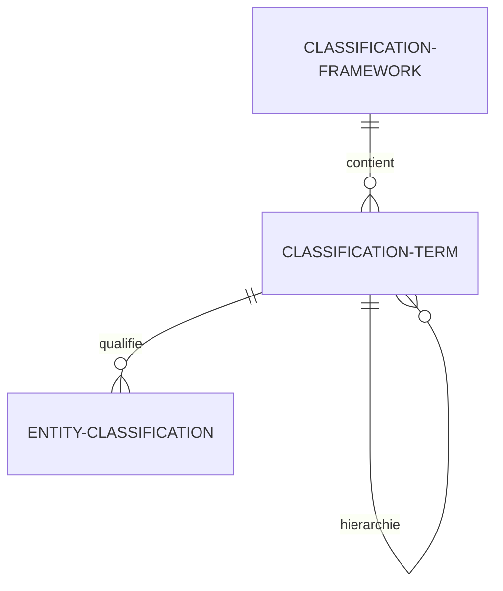

# FRAMEWORK DE CLASSIFICATION SÉMANTIQUE GÉNÉRIQUE

Ce document décrit le fonctionnement et le schéma de données du moteur de classification sémantique de la PIT vNext. Ce cadre unifie toutes les taxonomies sectorielles et technologiques sous un unique modèle de qualification sémantique.

---

## 1. LIMITES DU MODÈLE DE TAXONOMIE PRÉCÉDENT

Historiquement, chaque taxonomie possédait sa propre table physique (`StrategicValueChain`, `BusinessChallenge`, `S3Domain`, `NaceSector`, etc.). Cette architecture présentait trois inconvénients :
* **Prolifération des tables de liaison** : Chaque nouveau référentiel exigeait des relations "Many-to-Many" avec toutes les entités cibles (ex: `ServiceToS3Domain`, `BeneficiaryToS3Domain`, `ServiceToNace`, etc.).
* **Duplication du code d'API** : Obligation de coder des endpoints de filtrage spécifiques pour chaque dimension.
* **Absence d'évolutivité** : L'ajout d'une nouvelle grille d'évaluation (ex: TRL ou DigComp) nécessitait une modification du schéma Prisma et une migration physique.

---

## 2. MODÈLE CIBLE DE LA vNext

Le framework de classification sémantique repose sur trois tables génériques :



### A. `ClassificationFramework` (Le Référentiel)
Définit un cadre d'évaluation ou une taxonomie.
* **Attribut `frameworkType`** : Type qualitatif du référentiel (`TAXONOMY`, `VOCABULARY`, `MATURITY_MODEL`, `SKILL_MODEL`, `IMPACT_MODEL`, `CLASSIFICATION_MODEL`). Voir [PIT_FRAMEWORK_TYPES.md](file:///c:/Users/Philippe%20Pisetta/Downloads/testing%20CPSV-AP/docs/architecture/PIT_FRAMEWORK_TYPES.md) pour le détail.
* Exemples : `DR-BEST`, `S3`, `NACE`, `TRL`, `DMAT`.

### B. `ClassificationTerm` (Le Terme)
Représente un élément ou tag spécifique appartenant à un référentiel, avec support d'une hiérarchie récursive (parent/enfant).
* Exemples : 
  * `D` (Démo), `R` (Readiness) pour le framework `DR-BEST`.
  * `S3-NUM` (Numérique), `VC-NUMERIQUE` (Chaîne du numérique) pour `S3`.
  * `TRL-4` (Validation en laboratoire) pour `TRL`.

### C. `EntityClassification` (La Liaison)
Associe un terme de classification à n'importe quelle entité du système (`Service`, `Beneficiary`, `JourneyTemplate`, `InterventionNode`, `Activity`, etc.) à l'aide d'un polymorphisme relationnel.

---

## 3. EXEMPLES D'ALIGNEMENT SÉMANTIQUE

### Exemple 1 : Diagnostic IA
Un service d'accompagnement IA peut être caractérisé de la manière suivante :

* **Entité** : `PublicService` (ID: 15)
* **Classifications associées** :
  * `Framework: DR-BEST` → `Term: R` (Readiness)
  * `Framework: S3` → `Term: S3-NUM` (Numérique)
  * `Framework: TRL` → `Term: TRL-2` (Concept technologique formulé)
  * `Framework: NACE` → `Term: 62.02` (Conseil informatique)

### Exemple 2 : PME BioPlast
Un bénéficiaire cherchant des solutions de recyclage :

* **Entité** : `Beneficiary` (ID: 42)
* **Classifications associées** :
  * `Framework: NACE` → `Term: 22.21` (Fabrication de plaques et tubes en plastique)
  * `Framework: S3` → `Term: S3-CIRCULAR-ECON` (Économie circulaire)

---

## 4. CODE PRISMA DU SCHÉMA DE CLASSIFICATION

Le schéma physique implémenté dans Prisma utilise des index de recherche uniques composites pour optimiser les performances de requêtage et d'agrégation :

```prisma
enum FrameworkType {
  TAXONOMY
  VOCABULARY
  MATURITY_MODEL
  SKILL_MODEL
  IMPACT_MODEL
  CLASSIFICATION_MODEL
}

model ClassificationFramework {
  id          Int                  @id @default(autoincrement())
  code        String               @unique // ex: DR-BEST, S3, NACE, TRL, DMAT
  name        String
  description String?              @db.Text
  frameworkType FrameworkType        @default(TAXONOMY)
  
  terms       ClassificationTerm[]
  
  createdAt   DateTime             @default(now())
  updatedAt   DateTime             @updatedAt

  @@map("classification_frameworks")
}

model ClassificationTerm {
  id             Int                  @id @default(autoincrement())
  code           String               @unique // ex: DRBEST-D, S3-NUM, TRL-4
  name           String
  description    String?              @db.Text
  
  frameworkId    Int
  framework      ClassificationFramework @relation(fields: [frameworkId], references: [id], onDelete: Cascade)
  
  parentId       Int?
  parent         ClassificationTerm?  @relation("TermHierarchy", fields: [parentId], references: [id], onDelete: SetNull)
  children       ClassificationTerm[] @relation("TermHierarchy")
  
  classifications EntityClassification[]
  
  createdAt      DateTime             @default(now())
  updatedAt      DateTime             @updatedAt

  @@map("classification_terms")
}

model EntityClassification {
  id             Int                 @id @default(autoincrement())
  entityType     String              // ex: Service, Beneficiary, Activity...
  entityId       Int
  
  termId         Int
  term           ClassificationTerm  @relation(fields: [termId], references: [id], onDelete: Cascade)
  
  // Clés étrangères physiques pour l'optimisation des requêtes Prisma
  serviceId      Int?
  service        PublicService?      @relation(fields: [serviceId], references: [id], onDelete: Cascade)
  
  beneficiaryId  Int?
  beneficiary    Beneficiary?        @relation(fields: [beneficiaryId], references: [id], onDelete: Cascade)
  
  nodeId         Int?
  node           InterventionNode?   @relation(fields: [nodeId], references: [id], onDelete: Cascade)
  
  journeyTemplateId Int?
  journeyTemplate JourneyTemplate?   @relation(fields: [journeyTemplateId], references: [id], onDelete: Cascade)
  
  journeyInstanceId Int?
  journeyInstance JourneyInstance?   @relation(fields: [journeyInstanceId], references: [id], onDelete: Cascade)

  organizationId Int?
  organization   Organization?       @relation(fields: [organizationId], references: [id], onDelete: Cascade)

  ecosystemId    Int?
  ecosystem      Ecosystem?          @relation(fields: [ecosystemId], references: [id], onDelete: Cascade)

  createdAt      DateTime            @default(now())
  updatedAt      DateTime            @updatedAt

  @@unique([entityType, entityId, termId])
  @@index([entityType, entityId])
  @@map("entity_classifications")
}
```
