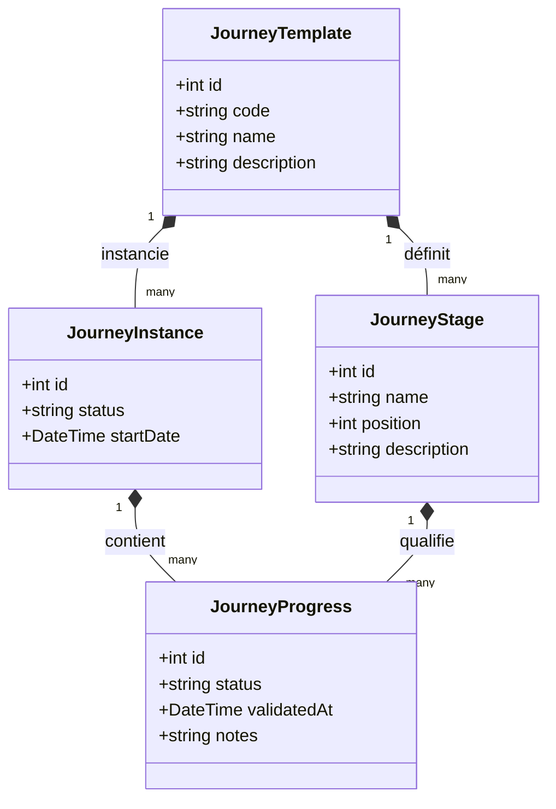

# JOURNEY FRAMEWORK (MOTEUR DE PARCOURS)

Ce document décrit le nouveau cadre de gestion des parcours d'accompagnement de la PIT vNext. Il détaille la séparation entre les modèles de parcours théoriques et le suivi dynamique de l'avancement des bénéficiaires.

---

## 1. DU PARCOURS UNIQUE VERS LE PARCOURS DÉCOUPLÉ

Dans la version précédente de la PIT, les parcours étaient modélisés par une seule table rigide (`Journey`) et des étapes semi-statiques (`JourneyStage`). 

Le Journey Framework vNext sépare le **modèle théorique** et l'**avancement réel** :
* **JourneyTemplate** (Modèle) : Représente la structure d'un parcours technologique ou sectoriel spécifique (ex: *Transformation Digitale PME*, *IA Industrielle*, *Transition Énergétique*).
* **JourneyStage** (Étape) : Les phases ordonnées spécifiques d'un template donné. Chaque template définit son propre nombre et ordre d'étapes (ex: un parcours IA aura 4 étapes, un parcours Circularité en aura 6).
* **JourneyInstance** (Inscription) : Matérialise l'inscription d'un bénéficiaire précis à un parcours.
* **JourneyProgress** (Suivi) : Trace l'avancement réel du bénéficiaire étape par étape (`TODO`, `IN_PROGRESS`, `COMPLETED`), avec commentaires et dates de validation.

---

## 2. MODÈLE CIBLE DE LA vNext



---

## 3. COMPORTEMENT DE L'ALGORITHME DE RECOMMANDATION vNext

Le moteur de recommandation de la PIT vNext utilise les étapes de parcours comme axe directeur d'accompagnement.

```
[Bénéficiaire] 
      │
      ▼
[Trouver sa JourneyInstance active] 
      │
      ▼
[Calculer son étape en cours (JourneyProgress = IN_PROGRESS)]
      │
      ├───────────────────────► Étape Actuelle ──► [Recommander Services de l'étape]
      │
      └───────────────────────► Étape Suivante ──► [Recommander Services de l'étape]
```

### Logique algorithmique détaillée :
1. **Étape Actuelle (Current Stage)** : Déterminée comme la première étape (triée par `position` croissante) d'une `JourneyInstance` dont le `JourneyProgress` n'est pas encore `COMPLETED`.
2. **Étape Suivante (Next Stage)** : L'étape dont la position est immédiatement supérieure à l'étape actuelle.
3. **Sélection des Services** :
   * Extraire les services associés directement aux étapes calculées (via la relation `JourneyStage.services`).
   * Prioriser les services de l'Étape Actuelle avec la mention *"Recommandé pour votre étape en cours : [Nom de l'étape]"*.
   * Proposer les services de l'Étape Suivante avec la mention *"Préparez votre étape suivante : [Nom de l'étape]"*.
4. **Qualification complémentaire** : Si plusieurs services sont éligibles pour une étape, le moteur les trie en fonction du profil du bénéficiaire (secteur NACE, niveau de maturité, ou défis).

---

## 4. SCHÉMA PRISMA DU CADRE DE PARCOURS

```prisma
model JourneyTemplate {
  id              Int                   @id @default(autoincrement())
  code            String                @unique // ex: J-DIGITAL, J-IA, J-CYBER
  name            String
  description     String?               @db.Text
  
  stages          JourneyStage[]
  instances       JourneyInstance[]
  classifications EntityClassification[]
  
  createdAt       DateTime              @default(now())
  updatedAt       DateTime              @updatedAt

  @@map("journey_templates")
}

model JourneyStage {
  id              Int               @id @default(autoincrement())
  name            String            // ex: Sensibilisation, Audit, Prototype...
  position        Int               // Ordre d'affichage
  description     String?           @db.Text
  
  templateId      Int
  template        JourneyTemplate   @relation(fields: [templateId], references: [id], onDelete: Cascade)
  
  services        PublicService[]   @relation("StageServices")
  progresses      JourneyProgress[]
  serviceDeliveries ServiceDelivery[] @relation("DeliveryStages")
  
  createdAt       DateTime          @default(now())
  updatedAt       DateTime          @updatedAt

  @@map("journey_stages")
}

model JourneyInstance {
  id              Int               @id @default(autoincrement())
  status          String            @default("ACTIVE") // ACTIVE, COMPLETED, CANCELLED
  startDate       DateTime          @default(now())
  endDate         DateTime?
  
  beneficiaryId   Int
  beneficiary     Beneficiary       @relation(fields: [beneficiaryId], references: [id], onDelete: Cascade)
  
  templateId      Int
  template        JourneyTemplate   @relation(fields: [templateId], references: [id], onDelete: Cascade)
  
  progresses      JourneyProgress[]
  classifications EntityClassification[]
  
  createdAt       DateTime          @default(now())
  updatedAt       DateTime          @updatedAt

  @@map("journey_instances")
}

model JourneyProgress {
  id              Int             @id @default(autoincrement())
  status          String          @default("TODO") // TODO, IN_PROGRESS, COMPLETED
  validatedAt     DateTime?
  notes           String?         @db.Text
  
  instanceId      Int
  instance        JourneyInstance @relation(fields: [instanceId], references: [id], onDelete: Cascade)
  
  stageId         Int
  stage           JourneyStage    @relation(fields: [stageId], references: [id], onDelete: Cascade)
  
  createdAt       DateTime        @default(now())
  updatedAt       DateTime        @updatedAt

  @@unique([instanceId, stageId])
  @@map("journey_progresses")
}
```

---

## 5. RELATIONS INTER-PARCOURS (JOURNEY RELATIONSHIPS)

Les parcours de transformation territoriaux ne sont pas des silos isolés. Pour permettre des recommandations intelligentes croisées et guider le bénéficiaire après la réussite d'un parcours, la PIT vNext introduit le concept de **JourneyRelationship**.

* **Définition** : Une `JourneyRelationship` définit un lien sémantique orienté et logique reliant un `JourneyTemplate` à un autre.
* **Types de relations autorisées** :
  * `PRECEDES` (Antériorité logique) : Un parcours doit idéalement être complété avant d'en entamer un autre.
    * *Exemple* : `Parcours Cybersécurité` → `PRECEDES` → `Parcours Certification NIS2`.
  * `COMPLEMENTS` (Synergie) : Les deux parcours s'enrichissent mutuellement.
    * *Exemple* : `Parcours IA` → `COMPLEMENTS` → `Parcours Financement Innovation`.
  * `REQUIRES` (Dépendance stricte) : Un parcours requiert obligatoirement la complétion ou l'inscription active à un autre.
    * *Exemple* : `Parcours IA` → `REQUIRES` → `Parcours Data / Gouvernance`.
  * `ALTERNATIVE_TO` (Option équivalente) : Propose une trajectoire alternative selon la taille ou le secteur du bénéficiaire.
    * *Exemple* : `Parcours Transition Énergétique PME` → `ALTERNATIVE_TO` → `Parcours Industrie 4.0 Décarbonation` (pour les grandes industries).
  * `PART_OF` (Inclusion hiérarchique) : Un parcours spécialisé fait partie d'une trajectoire plus globale.
    * *Exemple* : `Parcours Cybersécurité PME` → `PART_OF` → `Parcours global de Maturité Digitale`.
* **Impact sur le moteur de recommandation** :
  * Lorsque l'entreprise arrive en phase de **Suivi** (`SUIVI`) d'un parcours, le moteur sémantique recherche les relations `PRECEDES` ou `COMPLEMENTS` partant de ce parcours pour suggérer automatiquement le *vNext Journey* optimal.
  * Si un utilisateur tente de s'inscrire à un parcours sans respecter une relation `REQUIRES`, la PIT l'alerte et lui conseille d'initier le parcours prérequis en parallèle.

### Modélisation Prisma (Optionnelle et additive) :
```prisma
enum JourneyRelationshipType {
  PRECEDES
  COMPLEMENTS
  REQUIRES
  ALTERNATIVE_TO
  PART_OF
}

model JourneyRelationship {
  id             Int                     @id @default(autoincrement())
  relationship   JourneyRelationshipType
  
  // Parcours Source
  sourceTemplateId Int
  sourceTemplate   JourneyTemplate       @relation("SourceJourneyRel", fields: [sourceTemplateId], references: [id], onDelete: Cascade)
  
  // Parcours Cible
  targetTemplateId Int
  targetTemplate   JourneyTemplate       @relation("TargetJourneyRel", fields: [targetTemplateId], references: [id], onDelete: Cascade)
  
  createdAt      DateTime                @default(now())
  updatedAt      DateTime                @updatedAt

  @@unique([sourceTemplateId, targetTemplateId, relationship])
  @@map("journey_relationships")
}
```
