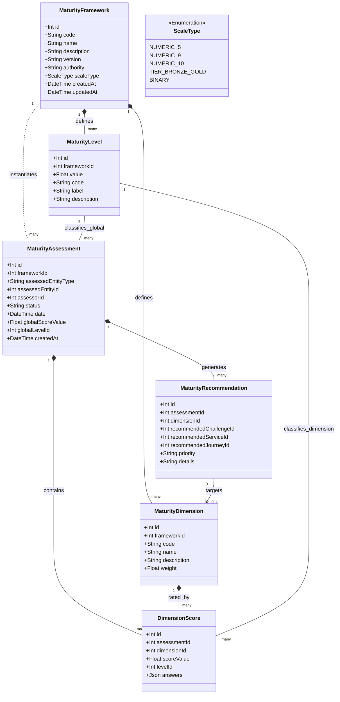

# 🌐 Plateforme d'Intelligence Territoriale (PIT) — Architecture des Frameworks de Maturité

## Référentiel de Modélisation Générique (v1.0)

Ce document définit l'architecture de référence et le modèle de données générique de la **Plateforme d'Intelligence Territoriale (PIT)** pour la gestion unifiée des frameworks de maturité. L'objectif est de structurer un modèle capable de représenter n'importe quel questionnaire, audit ou indice de performance (actuel ou futur) sans altérer le schéma physique de la base de données à chaque nouveau programme.

---

## 🌟 1. Inventaire des Frameworks de Maturité

### A. Digital

1.  **Digiscore** :
    *   *Objectif* : Évaluer la maturité numérique globale des PME wallonnes.
    *   *Population cible* : Toutes PME et TPE établies en Wallonie.
    *   *Dimensions* : Stratégie & Organisation, Processus métiers, Infrastructures & Sécurité, Client & Marché.
    *   *Score global* : Pourcentage de conformité global (0-100%) et niveau (1 à 5).
    *   *Granularité* : Score par dimension.
    *   *Fréquence* : Annuelle ou bisannuelle.
    *   *Usages PIT* : Diagnostic de base pour orienter l'entreprise vers ses premiers parcours de transformation digitale.
2.  **DMAT (Digital Maturity Assessment Tool)** :
    *   *Objectif* : Standard de la Commission Européenne pour mesurer la maturité numérique des bénéficiaires des hubs EDIH.
    *   *Population cible* : PME et administrations accompagnées par les EDIH.
    *   *Dimensions* : Préparation numérique, Stratégie d'affaires numérique, Compétences numériques, Gestion des données, Sécurité, Infrastructures technologiques.
    *   *Score global* : Niveau global de 1 à 5.
    *   *Granularité* : Note de 1 à 5 pour chacune des 6 dimensions.
    *   *Fréquence* : Évaluation obligatoire initiale (Pre-assessment) et finale (Post-assessment).
    *   *Usages PIT* : Suivre et justifier la conformité de l'EDIH Wallonia auprès de la Commission Européenne.
3.  **COMPASS** :
    *   *Objectif* : Modèle d'évaluation de l'alignement et de la maturité organisationnelle territoriale.
    *   *Population cible* : Opérateurs d'accompagnement et écosystèmes.
    *   *Dimensions* : Gouvernance, Services, Données, Infrastructures, Compétences numériques.
    *   *Score global* : Niveau d'alignement qualitatif (Émergent, Défini, Intégré, Optimisé).
    *   *Granularité* : Axes de gouvernance.
    *   *Fréquence* : Annuelle.
    *   *Usages PIT* : Auditer et piloter les opérateurs de l'écosystème PIT.
4.  **DESI (Digital Economy and Society Index)** :
    *   *Objectif* : Indice européen de performance de l'économie et de la société numériques.
    *   *Population cible* : Régions / États (Territoires).
    *   *Dimensions* : Capital humain, Connectivité, Intégration des technologies, Services publics numériques.
    *   *Score global* : Note globale de 0 à 100.
    *   *Granularité* : Agrégats territoriaux macro-économiques.
    *   *Fréquence* : Annuelle.
    *   *Usages PIT* : Aligner les indicateurs territoriaux (`Territory`) sur les objectifs macro-régionaux.
5.  **Digital Maturity Models** :
    *   *Objectif* : Modèles de maturité du marché (ex: TM Forum DMM) pour un audit de détail.
    *   *Population cible* : Entreprises de taille intermédiaire (ETI) et grandes industries.
    *   *Dimensions* : Client, Stratégie, Technologie, Opérations, Culture, Données.
    *   *Score global* : Niveau de maturité global de 1 à 5.
    *   *Granularité* : Questionnaires détaillés (100+ points).
    *   *Fréquence* : Ponctuelle.
    *   *Usages PIT* : Cartographie des capacités technologiques industrielles avancées.

### B. Intelligence Artificielle

1.  **AI Readiness** :
    *   *Objectif* : Mesurer le degré de préparation d'une entreprise avant d'implémenter l'IA.
    *   *Population cible* : PME et industries souhaitant lancer des PoC IA.
    *   *Dimensions* : Disponibilité des données, Infrastructures de calcul, Compétences internes, Cas d'usage métiers, Culture & Éthique.
    *   *Score global* : Niveau descriptif (Explorateur, Initié, Prêt, Avancé).
    *   *Granularité* : 5 niveaux.
    *   *Fréquence* : Déclenchée en phase de cadrage de projet.
    *   *Usages PIT* : Recommander des services d'expérimentation (Test Before Invest) ou de formation.
2.  **AI Maturity** :
    *   *Objectif* : Évaluer le niveau d'industrialisation des modèles d'IA déployés.
    *   *Population cible* : Entreprises exploitant déjà des modèles en production.
    *   *Dimensions* : Algorithmes & Modèles, Pipelines MLOps/DataOps, Gouvernance de l'IA, ROI business.
    *   *Score global* : Niveau 1 à 5.
    *   *Granularité* : Technique et opérationnelle.
    *   *Fréquence* : Revues de projets.
    *   *Usages PIT* : Mesurer le succès des subventions de R&D régionales.
3.  **AI Adoption Frameworks** :
    *   *Objectif* : Aligner la stratégie d'IA sur la gouvernance d'entreprise.
    *   *Population cible* : Grandes entreprises de l'écosystème.
    *   *Dimensions* : Technologie, Stratégie, Culture, Gouvernance.
    *   *Score global* : Évaluation de maturité qualitative.
    *   *Granularité* : Macro-gouvernance.
    *   *Fréquence* : Annuelle.
    *   *Usages PIT* : Alignement stratégique S3.
4.  **EDIH AI Assessment** :
    *   *Objectif* : Évaluation spécifique de la maturité IA intégrée au reporting DMAT.
    *   *Population cible* : PME accompagnées sur des thématiques IA.
    *   *Dimensions* : Compétences IA, Qualité des bases de données, Sécurité des modèles, Conformité (AI Act).
    *   *Score global* : Index IA.
    *   *Granularité* : Par dimension technique.
    *   *Fréquence* : Pre/Post accompagnement.
    *   *Usages PIT* : Matchmaking automatique avec le catalogue de services de l'EDIH.

### C. Cybersécurité

1.  **Cyber Fundamentals (CCB)** :
    *   *Objectif* : Référentiel belge (Centre pour la Cybersécurité Belgique) visant à évaluer la posture de sécurité de base d'une organisation.
    *   *Population cible* : PME, grandes entreprises et administrations publiques belges.
    *   *Dimensions* : Gestion des identités, Sécurité des terminaux, Protection réseau, Sauvegarde et reprise, Sensibilisation des utilisateurs.
    *   *Score global* : Niveaux cumulatifs (Petit, Moyen, Grand) ou taux de conformité (%).
    *   *Granularité* : Checklist de contrôles de sécurité critiques.
    *   *Fréquence* : Annuelle ou suite à un incident.
    *   *Usages PIT* : Diagnostiquer les failles de sécurité et recommander les chèques cybersécurité.
2.  **NIS2** :
    *   *Objectif* : Conformité réglementaire avec la directive européenne NIS2 pour les entités essentielles et importantes.
    *   *Population cible* : Moyennes et grandes entreprises des secteurs critiques.
    *   *Dimensions* : Analyse des risques, Gestion des incidents, Continuité d'activité, Sécurité de la chaîne d'approvisionnement, Chiffrement.
    *   *Score global* : Conforme / Non Conforme.
    *   *Granularité* : Checklist réglementaire.
    *   *Fréquence* : Audit périodique et surveillance continue.
    *   *Usages PIT* : Détection automatique des besoins d'accompagnement juridique et technique de conformité NIS2.
3.  **Cyber Readiness Models** :
    *   *Objectif* : Évaluer la capacité opérationnelle à répondre aux cyberattaques.
    *   *Population cible* : Entreprises de toutes tailles.
    *   *Dimensions* : Politiques de sécurité, Technologies déployées, Compétences humaines.
    *   *Score global* : Niveau de 1 à 5.
    *   *Granularité* : Opérationnelle.
    *   *Fréquence* : Trimestrielle ou semestrielle.
    *   *Usages PIT* : Déclenchement de parcours de sensibilisation des employés.

### D. Innovation

1.  **TRL (Technology Readiness Level)** :
    *   *Objectif* : Évaluer le niveau de maturité d'une technologie ou d'un produit innovant.
    *   *Population cible* : Startups, centres de recherche et projets de R&D.
    *   *Dimensions* : Principes de base, Validation en laboratoire, Prototype, Démonstrateur opérationnel, Lancement commercial.
    *   *Score global* : Échelle standard de 1 à 9 (TRL 1 à TRL 9).
    *   *Granularité* : Échelons stricts définis par Horizon Europe.
    *   *Fréquence* : Jalons clés de projets.
    *   *Usages PIT* : Orienter les startups vers les bons guichets de financement (FEDER, chèques, capital-risque).
2.  **MRL (Manufacturing Readiness Level)** :
    *   *Objectif* : Évaluer l'aptitude d'une technologie à entrer en phase de production industrielle de masse.
    *   *Population cible* : PME manufacturières et industrielles.
    *   *Dimensions* : Chaîne d'approvisionnement, Contrôle des processus, Coût, Conception de production, Qualité.
    *   *Score global* : Échelle de 1 à 10.
    *   *Granularité* : Niveaux de maturité industrielle.
    *   *Fréquence* : Avant l'industrialisation.
    *   *Usages PIT* : Recommander des parcours de type "Usine du Futur" ou "Industrie 4.0".
3.  **BRL (Business Readiness Level)** :
    *   *Objectif* : Évaluer la maturité commerciale et de marché d'une innovation.
    *   *Population cible* : Startups, spin-offs et PME innovantes.
    *   *Dimensions* : Étude de marché, Validation client, Modèle d'affaires, Pricing, Canaux de vente.
    *   *Score global* : Échelle de 1 à 9.
    *   *Granularité* : Commerciale.
    *   *Fréquence* : Levées de fonds et phases de scale-up.
    *   *Usages PIT* : Aligner les aides à l'internationalisation de l'AWEX ou de coaching d'affaires.
4.  **Innovation Readiness** :
    *   *Objectif* : Évaluer la capacité interne d'une organisation à générer de l'innovation continue.
    *   *Population cible* : Toutes entreprises.
    *   *Dimensions* : Leadership, Processus d'innovation, Ressources allouées, Collaboration.
    *   *Score global* : Niveau 1 à 5.
    *   *Granularité* : Organisationnelle.
    *   *Fréquence* : Annuelle.
    *   *Usages PIT* : Auditer la résilience territoriale et orienter les collaborations S3.

### E. Circularité

1.  **CRL (Circular Readiness Level)** :
    *   *Objectif* : Mesurer le niveau de maturité d'une entreprise dans l'adoption de l'économie circulaire.
    *   *Population cible* : PME manufacturières, chimie, construction et textile.
    *   *Dimensions* : Éco-conception, Sourcing responsable, Prolongation de la durée de vie, Valorisation/Recyclage, Modèles de l'économie de la fonctionnalité.
    *   *Score global* : Niveau de 1 à 5.
    *   *Granularité* : Par dimension d'économie circulaire.
    *   *Fréquence* : Annuelle.
    *   *Usages PIT* : Orienter les entreprises vers le programme Circular Design & Materials.
2.  **Circular Readiness** :
    *   *Objectif* : Modèle d'évaluation générique pour la réduction d'empreinte environnementale.
    *   *Population cible* : Entreprises de services et d'industrie.
    *   *Dimensions* : Flux de matières, Efficacité énergétique, Gestion de l'eau, Valorisation des déchets.
    *   *Score global* : Indice de circularité (0-100%).
    *   *Granularité* : Quantitative.
    *   *Fréquence* : Annuelle.
    *   *Usages PIT* : Corrélation avec les objectifs régionaux de transition verte.
3.  **Circular Wallonia** :
    *   *Objectif* : Indicateurs d'impact et de conformité définis par la stratégie régionale Circular Wallonia.
    *   *Population cible* : Acteurs industriels des chaînes de valeur prioritaires régionales.
    *   *Dimensions* : Réduction de déchets, Sourcing local, Symbioses industrielles.
    *   *Score global* : Indicateurs de conformité.
    *   *Granularité* : Sectorielle.
    *   *Fréquence* : Jalons des plans d'action régionaux.
    *   *Usages PIT* : Matchmaking d'opportunités d'économie circulaire inter-entreprises.

### F. Business

1.  **Business Readiness** :
    *   *Objectif* : Évaluer la viabilité financière et la résilience opérationnelle d'une PME.
    *   *Population cible* : TPE et PME en phase de consolidation.
    *   *Dimensions* : Gestion financière, Cadre juridique, Processus RH, Efficacité opérationnelle.
    *   *Score global* : Niveau 1 à 5.
    *   *Granularité* : Administrative et financière.
    *   *Fréquence* : Annuelle.
    *   *Usages PIT* : Diagnostic pour orienter vers des aides de gestion ou de restructuration financière.
2.  **Export Readiness** :
    *   *Objectif* : Évaluer si une entreprise est prête à exporter ses produits ou services à l'international.
    *   *Population cible* : PME wallonnes ciblant des marchés étrangers.
    *   *Dimensions* : Capacité de production, Marketing international, Conformité réglementaire douanière, Compétences linguistiques, Trésorerie disponible.
    *   *Score global* : Taux de préparation à l'export (%).
    *   *Granularité* : Niveaux de maturité export (1 à 5).
    *   *Fréquence* : Avant le lancement de missions de prospection.
    *   *Usages PIT* : Recommander automatiquement les services et incitants de l'AWEX.
3.  **Investment Readiness** :
    *   *Objectif* : Évaluer l'aptitude d'une startup/PME à attirer des investisseurs en capital.
    *   *Population cible* : Startups et scale-ups cherchant à lever des fonds.
    *   *Dimensions* : Qualité du pitch deck, Solidité du plan d'affaires, Gouvernance d'entreprise, Capitalisation, Solidité financière.
    *   *Score global* : Niveau 1 à 5.
    *   *Granularité* : Grille d'évaluation investisseur.
    *   *Fréquence* : Avant le lancement de levées de fonds.
    *   *Usages PIT* : Matching avec les instruments de financement de Wallonie Entreprendre (WE).
4.  **Scale-up Readiness** :
    *   *Objectif* : Mesurer la capacité d'une entreprise en hypercroissance à changer d'échelle sans rupture organisationnelle.
    *   *Population cible* : Startups matures et scale-ups.
    *   *Dimensions* : Scalabilité technologique, Organisation de l'équipe de management, Automatisation des processus commerciaux, Internationalisation.
    *   *Score global* : Niveau 1 à 5.
    *   *Granularité* : Scalabilité.
    *   *Fréquence* : Annuelle.
    *   *Usages PIT* : Recommander des programmes d'accélération intensifs régionaux.

---

## ⚖️ 2. Analyse Comparative & Matrice des Communs

L'analyse des différents frameworks met en lumière une structure conceptuelle récurrente :

1.  **Métadonnées du Référentiel** : Un nom officiel, une autorité publique ou réglementaire émettrice, une version et une cible.
2.  **Découpage hiérarchique** : Chaque framework regroupe un ensemble de dimensions ou sous-dimensions (axes).
3.  **Niveaux d'évaluation** : Les scores s'inscrivent toujours sur des échelles discrètes (ordinales) définies (1-5, 1-9, Bronze/Silver, etc.).
4.  **Date d'évaluation (Point in time)** : Une évaluation est une photographie à un instant T pour une entité spécifique.
5.  **Scores calculés** : Un résultat comporte un score global et un score par dimension.
6.  **Recommandations exploitables** : Le but final d'un audit est de déclencher des plans d'action (défis à relever, services/parcours à suivre).

### Matrice Comparative des Frameworks

| Framework | Type d'Échelle | Dimensions typiques | Entité Évaluée | Périodicité type | Usage PIT Principal |
| :--- | :---: | :--- | :---: | :---: | :--- |
| **Digiscore** | Ordinale (1-5) | Stratégie, Client, Infrastructure, Processus | PME | 1 à 2 ans | Diagnostic initial & Matching Parcours |
| **DMAT** | Ordinale (1-5) | Data, Cyber, Infrastructure, Skills, Strategy | PME / Admin | Pre / Post projet | Conformité européenne & Reporting EDIH |
| **COMPASS** | Qualitative (4) | Gouvernance, Services, Données, Skills | Opérateur / Hub | Annuelle | Audit d'alignement des Opérateurs |
| **TRL** | Ordinale (1-9) | Faisabilité, Validation, Prototype, Déploiement | Technologie / Projet | Par jalon | Évaluation d'aide financière R&D |
| **CRL** | Ordinale (1-5) | Éco-conception, Recyclage, Usage, Sourcing | PME / Industrie | Annuelle | Matching avec des offres Circulaires |
| **Cyber Fundamentals**| Tiers (3) | Identité, Réseau, Sauvegardes, Terminaux | PME / Admin | Annuelle | Détection de vulnérabilité & Chèques |
| **NIS2** | Binaire | Risques, Supply chain, Cryptage, Incidents | ETI / Grande Ent. | Continue | Conformité réglementaire industrielle |
| **Export Readiness** | Ordinale (1-5) | Production, Marketing, Trésorerie, Douanes | PME | Semestrielle | Recommandation automatique AWEX |
| **Investment Read.** | Ordinale (1-5) | Pitch, Business Plan, Trésorerie, Gouvernance | Startup / PME | Par levée | Recommandation de capital WE |

---

## 🧬 3. Le Modèle Générique de Maturité PIT

Pour éviter de créer des tables spécifiques pour chaque framework de maturité (Digiscore, DMAT, TRL, etc.), la PIT doit implémenter un **Modèle Générique de Framework de Maturité (GMF)**. Ce modèle permet de définir dynamiquement n'importe quel framework et d'en persister les évaluations.

### Diagramme de Classes UML (Modèle Sémantique)



### Description des Nouvelles Entités :

1.  **`MaturityFramework`** : Définit le framework lui-même (ex : `DMAT`, `TRL`, `CyberFundamentals`). L'attribut `scaleType` régit la logique de calcul et de rendu graphique (échelle 1-5, 1-9 ou Bronze/Silver/Gold).
2.  **`MaturityDimension`** : Représente un axe ou un pilier d'évaluation du framework (ex : dimension *Cybersécurité* du DMAT, dimension *Éco-conception* du CRL). Chaque dimension peut posséder un coefficient de pondération (`weight`).
3.  **`MaturityLevel`** : Représente les échelons possibles de l'échelle d'évaluation. L'attribut `value` normalise la valeur sous forme numérique (ex: TRL 4 = 4.0, Échelon "Bronze" = 1.0) pour simplifier le tri, la recherche et le tracé des courbes d'évolution.
4.  **`MaturityAssessment`** : Représente une session d'évaluation réalisée à une date donnée pour une entité spécifique (PME, Projet, Opérateur) par un auditeur (`assessorId` relié à `Organization`). Elle stocke le score global calculé.
5.  **`DimensionScore`** : Contient le score et le niveau obtenus pour chaque dimension de l'évaluation, ainsi que la charge utile JSON `answers` contenant le détail brut des réponses aux questions de cette dimension (dette technique évitée en évitant des tables de réponses complexes).
6.  **`MaturityRecommendation`** : Contient les propositions d'accompagnement découlant directement de l'évaluation (matching automatique vers un Défi, un Service CPSV-AP ou un Parcours de la PIT).

---

## 🔗 4. Intégration au Modèle PIT

Le modèle de maturité générique se connecte de manière fluide aux entités existantes du **Territorial Knowledge Graph** :

*   **`Beneficiary` (PME/Territoires)** : La table `Beneficiary` se connecte aux évaluations via une relation polymorphe lâche (`assessedEntityType = "Beneficiary"` et `assessedEntityId = Beneficiary.id`). Elle permet d'afficher l'historique de maturité d'une entreprise (ex : évolution de son score DMAT de l'an passé à aujourd'hui).
*   **`Organization` (Opérateurs)** : Une organisation peut être l'évaluée (ex : évaluation COMPASS de maturité de l'AdN) ou l'évaluatrice (`assessorId` de `MaturityAssessment` pointant vers l'opérateur réalisant l'audit).
*   **`Project` & `Program`** : Les projets d'innovation et programmes (ex : FEDER) sont associés à des évaluations de maturité technologique (TRL) ou industrielle (MRL) pour valider le déblocage d'enveloppes financières.
*   **`Journey` & `Service`** : Les recommandations issues d'une évaluation (`MaturityRecommendation`) pointent vers le catalogue de services CPSV-AP ou de parcours de transformation de la PIT.
*   **`Challenge` & `Capability`** : Les scores de dimension faibles (ex : dimension *Sécurité* < niveau 2) activent les défis (`Challenge`) correspondants du bénéficiaire et mettent en évidence ses besoins de capabilités (`Capability`).
*   **`Impact`** : Les gains nets de maturité (Maturity Delta : score final moins score initial) sont enregistrés comme des mesures d'impact réelles (`Impact`) rattachées à la gouvernance stratégique wallonne.

---

## 🧠 5. Alignements Conceptuels Majeurs

### A. Capabilité (Capability) vs Maturité (Maturity)

Il est fondamental de maintenir une distinction claire entre ces deux concepts dans la base de connaissances :

*   **La Capabilité (`Capability`)** : Répond à la question **"QUOI"**. C'est le domaine sémantique ou technologique concerné. Elle est de nature binaire ou catégorielle (ex : *IA*, *Cybersécurité*, *Cloud*, *IoT*). L'entreprise utilise-t-elle la technologie ? Oui ou Non. L'opérateur maîtrise-t-il le domaine ? Oui ou Non.
*   **La Maturité (`Maturity`)** : Répond à la question **"COMMENT / À QUEL NIVEAU"**. C'est le degré d'excellence, de complexité ou de pénétration de cette capabilité. Elle est de nature ordinale et mesurable.
*   *Exemple concret* :
    *   `Capability` = **IA (Intelligence Artificielle)**.
    *   `Maturity` = **Niveau 2 / 5 (AI Readiness)**. L'entreprise possède des données exploitables et a identifié des cas d'usage, mais n'a pas encore de modèles déployés ni d'ingénieurs qualifiés.

### B. DR-BEST vs Maturité (Maturity)

Il est officiellement établi dans l'architecture PIT v3.0 que :

*   **DR-BEST** est une **nomenclature de classification sémantique transversale** (Data, Remote, Business, Ecosystem, Skills, Technology) servant à classifier l'**offre de services publics et de parcours** d'accompagnement de la Wallonie (la boîte à outils régionale).
*   **La Maturité** est un **modèle d'évaluation dynamique** utilisé pour évaluer et stocker l'**état réel de la demande** (les PME accompagnées, les projets menés).
*   *Règle sémantique* : DR-BEST classifie le *savoir-faire* proposé par la Région ; la Maturité mesure le *degré de maîtrise* réel des acteurs du territoire.

---

## 🧭 6. Cinématique de Déclenchement par la Maturité

Une évaluation de maturité est le point d'entrée naturel du moteur d'orchestration de la PIT pour diriger les entreprises vers les dispositifs d'aides.

```
+---------------------------+
|    Maturity Assessment    |  Exemple : AI Readiness
|      Global Score < 2     |
+-------------+-------------+
              |
              v (Règle automatique)
+-------------+-------------+
|     Challenge Trigger     |  Exemple : Défi "Adoption IA" activé
|     (BusinessChallenge)   |
+-------------+-------------+
              |
              v (Matchmaking Recommender)
+-------------+-------------+
|   Journey Recommendation  |  Exemple : "Parcours IA PME" recommandé
|      (JourneyTemplate)    |
+-------------+-------------+
              |
              v (Cinématique des étapes du Parcours)
+-------------+-------------+
|    Recommended Services   |  1. Diagnostic IA (Stage 1)
|     (PublicService)       |  2. Formation IA (Stage 2)
|                           |  3. Test Before Invest (Stage 3)
+---------------------------+
```

### Exemple de cinématique opérationnelle :
1.  **Évaluation** : Une PME industrielle réalise l'évaluation **AI Readiness**.
    *   *Dimension "Skills"* = Niveau 1 / 5.
    *   *Dimension "Data"* = Niveau 2 / 5.
2.  **Défi** : PIT détecte des scores critiques (< Niveau 3) et active le défi **Adoption IA** sur le profil du bénéficiaire.
3.  **Parcours** : Le moteur de recommandation identifie le **Parcours IA PME** comme le plus aligné avec ce défi.
4.  **Services** : L'entreprise est orientée vers le parcours qui orchestre l'accompagnement :
    *   *Étape 1 (Diagnostic)* : Recommander le service `Diagnostic IA` (AdN).
    *   *Étape 2 (Formation)* : Recommander le service `Formation IA - Prise en main` (EDIH).
    *   *Étape 3 (PoC)* : Recommander le service `Test Before Invest IA` (Sirris).

---

## 🤖 7. Intégration dans le Recommender Engine

Le moteur de recommandation de la PIT calcule l'adéquation d'un Service, d'un Parcours ou d'un Programme pour un Bénéficiaire selon la formule sémantique multicritère suivante :

$$\text{Match Score} = f(\text{Challenge}, \text{Capability}, \text{Maturity}, \text{Territory}, \text{S3}, \text{DR-BEST}, \text{Impact})$$

Le moteur utilise les évaluations de maturité de la manière suivante :

1.  **Filtre de prérequis de maturité** : Empêche la recommandation de services trop complexes. Un service de type *Test Before Invest* ou *Consortium R&D S3* (nécessitant une maturité technologique ou numérique de niveau 3) ne sera jamais recommandé à une entreprise affichant une maturité DMAT ou TRL de niveau 1. Le système proposera d'abord des services de *Sensibilisation* ou de *Diagnostic*.
2.  **Priorisation par l'impact historique (Maturity Delta)** : Le système calcule les gains de maturité réels (impacts observés après accompagnement) des entreprises similaires (même province, même secteur NACE). Les services ayant historiquement généré le plus grand gain de maturité pour un profil donné sont classés en tête des recommandations.
3.  **Alignement DR-BEST / Dimensions** : Si la maturité d'une PME affiche un score faible sur la dimension *Cyber*, le moteur priorise les services et parcours classifiés sous le pilier *Technology (T)* et *Data (D)* du référentiel DR-BEST.

---

## 🇪🇺 8. Matrice d'Alignement Européen & Belge

| Framework | Référentiel Source | Rôle de l'Alignement & Cas d'usage PIT |
| :--- | :--- | :--- |
| **Digiscore** | Agence du Numérique (AdN) | Diagnostic numérique d'entrée par défaut pour toutes les PME wallonnes. |
| **DMAT** | Commission Européenne (EDIH) | Pré/Post audit réglementaire pour valider l'impact des services cofinancés par l'Europe (EDIH Wallonia). |
| **COMPASS** | Commission Européenne (JRC) | Évaluer l'efficacité des pôles de compétitivité et des écosystèmes d'innovation. |
| **TRL** | Horizon Europe / NASA | Déterminer l'éligibilité des projets d'innovation aux subventions S3 et fonds de recherche. |
| **CRL** | Circular Economy Action Plan (EU) | Orienter et mesurer l'impact des aides Circular Wallonia dans l'industrie. |
| **Cyber Fundamentals**| Centre de Cybersécurité Belgique | Diagnostiquer la sécurité des PME et orienter vers les chèques et audits Cyber. |
| **NIS2** | Directive Européenne NIS2 | Détecter les besoins d'accompagnement juridique et cyber-technique pour les entités régionales d'importance critique. |

---

## 🚀 9. Recommandations d'Architecture & Roadmap

### A. Modèle recommandé
*   Adopter le **Modèle Générique de Framework de Maturité (GMF)** décrit en section 3.
*   **Ne pas créer** de tables ou de colonnes spécifiques pour les futurs questionnaires (ex: NIS2, BRL, CRL). Toutes les évaluations doivent utiliser le triptyque sémantique `MaturityFramework`, `MaturityDimension`, `MaturityLevel`.

### B. Entités à créer (Prisma & DB)
*   **`MaturityFramework`** (Master table des frameworks).
*   **`MaturityDimension`** (Axe ou dimension spécifique d'un framework).
*   **`MaturityLevel`** (Niveau sémantique normalisé sur une valeur numérique).
*   **`MaturityAssessment`** (Session d'évaluation pour un bénéficiaire/projet).
*   **`DimensionScore`** (Score et réponses JSON par dimension).
*   **`MaturityRecommendation`** (Liaisons de recommandations d'aides issues de l'évaluation).

### C. Entités existantes à réutiliser / adapter
*   **`Beneficiary`** :
    *   *Action* : Supprimer les 5 colonnes de maturité codées en dur (`maturityDigital`, `maturityIa`, `maturityCyber`, `maturityExport`, `maturityDurability`).
    *   *Remplacement* : Remplacer par des relations dynamiques vers `MaturityAssessment`.
*   **`PublicService` & `Journey`** : Raccorder les services et parcours aux recommandations d'évaluation.
*   **`Impact`** : Utiliser la table d'impact pour historiser le "Maturity Delta" (gain net de maturité post-accompagnement).

### D. Risques & Mitigations
1.  **Risque de surcharge DB (Volume de réponses)** : Le stockage complet des formulaires de réponses dans la base transactionnelle peut ralentir les requêtes.
    *   *Mitigation* : Utiliser le champ `answers Json?` uniquement pour stocker les scores intermédiaires et métadonnées. Découpler les formulaires de réponses bruts dans un stockage de documents froid (Object Storage S3) et ne conserver en base de données relationnelle que les scores et recommandations.
2.  **Complexité d'affichage (Radar Charts multiples)** : La coexistence de Digiscore (1-5), DMAT (1-5 sur 6 dimensions), et TRL (1-9) peut nuire à la clarté de l'interface.
    *   *Mitigation* : Normaliser toutes les échelles sur un ratio flottant unifié de 0.0 à 1.0 dans le composant de visualisation radar, tout en conservant l'étiquette nominale réelle (ex: "TRL-4") pour l'utilisateur.

### E. Roadmap de Mise en Œuvre
1.  **Sprint 2.2 (Taxonomies)** : Intégrer les dimensions et niveaux des frameworks Digiscore, DMAT, et Cyber Fundamentals dans les scripts de seeds et référentiels.
2.  **Sprint 3 (Domain Model)** : Ajouter les 6 nouvelles tables du modèle de maturité générique dans le schéma Prisma et exécuter la migration de base de données.
3.  **Sprint 4 (Couche API)** : Créer les endpoints REST `/api/maturity/assessments` et le service d'évaluation des règles automatiques.
4.  **Sprint 5 (Interface Cockpit)** : Refactoriser la vue PME dans le module `/beneficiaries` pour afficher les radar charts multi-frameworks et les recommandations d'aides générées.
5.  **Sprint 6 (Recommender Integration)** : Connecter le moteur de recommandation IA pour filtrer les services en fonction des seuils de maturité du bénéficiaire.
