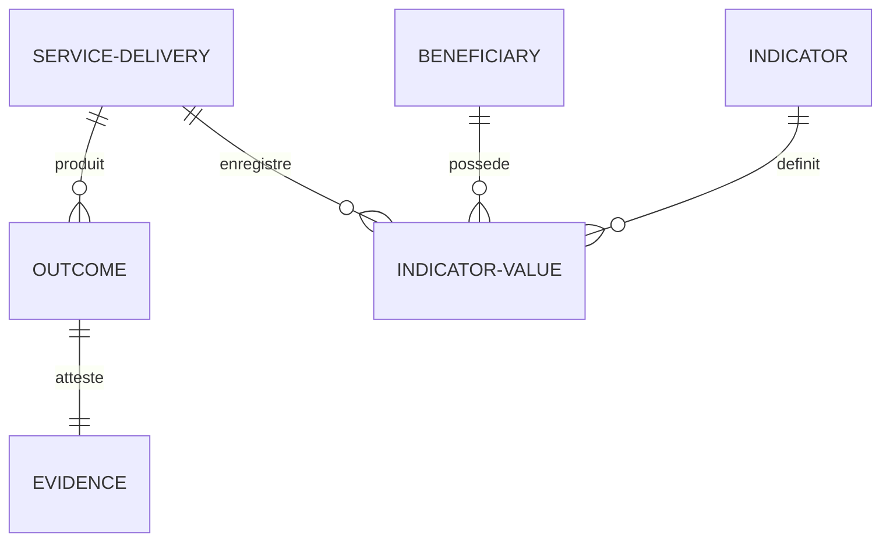

# CADRE D'ÉVALUATION ET DE MESURE D'IMPACT (OUTCOME & EVIDENCE FRAMEWORK)

Ce document décrit le cadre d'évaluation, d'impact et de capitalisation de la PIT vNext. Il formalise les concepts de **Outcomes**, **Evidences** et **Indicators** pour mesurer l'efficacité de l'accompagnement des bénéficiaires et piloter les politiques régionales.

---

## 1. POURQUOI STRUCTURER LES RÉSULTATS ?

Historiquement, la PIT trace ce qui est planifié (les programmes, projets) et ce qui est mis en catalogue (les services publics). Cependant, elle dispose de peu de mécanismes normés pour mesurer :
1. **Ce qui a été réellement produit** (les livrables validés).
2. **Le résultat direct** sur la maturité de l'entreprise (les changements d'état).
3. **Les preuves attestant de la réalité** de l'intervention (les documents justificatifs requis lors des audits européens).

Le framework d'évaluation vNext résout cela en distinguant les extrants (*outputs*), les résultats d'accompagnement (*outcomes*), les preuves physiques (*evidences*) et les indicateurs mesurables (*indicators*).

---

## 2. MODÈLE CONCEPTUEL D'ÉVALUATION



### A. Outcome (Le Résultat Métier)
L'outcome représente le changement d'état ou la valeur directe générée à la suite d'une prestation de service (`ServiceDelivery`).
* *Exemples* : Roadmap stratégique rédigée, Financement FEDER accordé, Audit de sécurité validé, Marché export ouvert.

### B. Evidence (La Preuve administrative/technique)
L'évidence est l'attestation physique, documentaire ou numérique prouvant qu'un outcome a bien eu lieu. Elle est indispensable pour la validation des subventions européennes (EDIH/FEDER).
* *Exemples* : Fichier PDF du diagnostic, Certificat de conformité ISO, Copie de facture d'audit, Rapport DMAT généré.

### C. Indicator (L'Indicateur d'Impact)
L'indicateur définit une mesure quantifiable ou qualitative de performance. Il permet de suivre l'évolution d'un bénéficiaire avant/après une intervention, ainsi que l'impact cumulatif d'un programme.
* *Exemples* : 
  * **Indicateurs de maturité** : DMAT Score, TRL (Technology Readiness Level), IRL (Investment Readiness Level), MRL.
  * **Indicateurs macro-économiques** : Chiffre d'affaires export, Nombre d'ETP créés, Émission de tonnes de CO2 économisées.

---

## 3. SCHÉMA DE DONNÉES PRISMA (AJOUT ADDITIF PHASE 0)

Le schéma physique sépare la définition de l'indicateur (`Indicator`) et les relevés de valeurs enregistrés dans le temps (`IndicatorValue`) pour tracer la trajectoire de maturité de chaque PME :

```prisma
model Outcome {
  id                Int                   @id @default(autoincrement())
  uri               String?               @unique
  code              String                @unique // ex: OUT-ROADMAP-OK
  name              String
  description       String?               @db.Text
  
  // Prestation génératrice
  deliveryId        Int
  delivery          ServiceDelivery       @relation(fields: [deliveryId], references: [id], onDelete: Cascade)
  
  // Preuve associée
  evidenceId        Int?                  @unique
  evidence          Evidence?             @relation(fields: [evidenceId], references: [id], onDelete: SetNull)
  
  createdAt         DateTime              @default(now())
  updatedAt         DateTime              @updatedAt

  @@map("outcomes")
}

model Evidence {
  id                Int                   @id @default(autoincrement())
  uri               String?               @unique
  fileName          String
  filePath          String                // Stockage physique du justificatif
  fileSize          Int
  mimeType          String
  hash              String                // Intégrité du fichier (SHA-256)
  
  outcome           Outcome?
  
  createdAt         DateTime              @default(now())
  updatedAt         DateTime              @updatedAt

  @@map("evidences")
}

model Indicator {
  id                Int                   @id @default(autoincrement())
  code              String                @unique // ex: IND-TRL, IND-DMAT-CYBER, IND-JOBS
  name              String
  description       String?               @db.Text
  unit              String                // ex: niveau (1-9), ETP, EUR, tonnes CO2
  
  values            IndicatorValue[]
  
  createdAt         DateTime              @default(now())
  updatedAt         DateTime              @updatedAt

  @@map("indicators")
}

model IndicatorValue {
  id                Int                   @id @default(autoincrement())
  value             Float                 // Valeur mesurée
  date              DateTime              @default(now())
  notes             String?               @db.Text
  
  indicatorId       Int
  indicator         Indicator             @relation(fields: [indicatorId], references: [id], onDelete: Cascade)
  
  beneficiaryId     Int
  beneficiary       Beneficiary           @relation(fields: [beneficiaryId], references: [id], onDelete: Cascade)
  
  // Optionnel : Relevé associé à une prestation précise
  deliveryId        Int?
  delivery          ServiceDelivery?      @relation(fields: [deliveryId], references: [id], onDelete: SetNull)

  createdAt         DateTime              @default(now())
  updatedAt         DateTime              @updatedAt

  @@index([beneficiaryId])
  @@index([indicatorId])
  @@map("indicator_values")
}
```

*Note : Les relations d'intégration dans `ServiceDelivery` s'écrivent ainsi :*
```prisma
// Ajouté dans model ServiceDelivery :
// outcomes Outcome[]
// indicatorValues IndicatorValue[]
```
---

## 4. IMPACTS SUR LE PILOTAGE ET LA GOUVERNANCE

Ce framework d'évaluation permet de propulser deux types de fonctionnalités critiques pour la PIT :

1. **Le calcul du Delta de Maturité (Avant/Après)** :
   Lorsqu'une PME réalise un diagnostic (ServiceDelivery), l'opérateur saisit sa valeur DMAT initiale (`IndicatorValue` lié au service, ex: 1/5). Après le coaching, une nouvelle valeur est consignée (ex: 3/5). Le système calcule instantanément le ROI qualitatif de l'accompagnement.
2. **L'agrégation d'impact à la maille territoriale** :
   Pour un territoire (ex: Province de Liège), la PIT peut sommer toutes les `IndicatorValue` de type "Réduction CO2" issues des livraisons de services du programme *Circular Wallonia* pour prouver l'impact réel de la politique régionale sur la décarbonation.

---

## 5. CADRE DE CONTRIBUTION D'IMPACT (CONTRIBUTION FRAMEWORK)

Toutes les interventions publiques n'ont pas le même type d'influence sur les résultats d'un territoire. Pour éviter de fausser les rapports d'impact ou d'imputer des succès de manière abusive (ex: attribuer la création de 100 emplois à un simple atelier d'idéation d'une heure), la PIT vNext introduit le concept de **ContributionType**.

* **Définition** : Le type de contribution qualifie le niveau d'influence causale d'un jalon ou d'un service sur un résultat ou un indicateur.
* **Typologie de contribution** :
  * `DIRECT` (Lien direct) : L'intervention produit le résultat de manière immédiate et vérifiable.
    * *Exemple* : Un diagnostic de cybersécurité produit directement une feuille de route de remédiation (`TRL +1` ou `DMAT Cyber +1`).
  * `INDIRECT` (Lien d'influence) : L'intervention prépare ou facilite l'obtention du résultat sans en être la cause exclusive.
    * *Exemple* : Un atelier de sensibilisation à la cybersécurité contribue indirectement à la sécurisation des infrastructures de la PME.
  * `ASSUMED` (Lien théorique supposé) : Lien basé sur des modèles théoriques ou macro-économiques d'évaluation.
    * *Exemple* : On suppose qu'un accompagnement à la décarbonation permet une baisse des émissions carbone.
  * `ESTIMATED` (Estimation prévisionnelle) : L'impact n'est pas mesuré physiquement mais estimé par des experts.
    * *Exemple* : Gain de productivité estimé à 15% après installation d'une ligne connectée.
* **Impact sur les tableaux de bord (Cockpits S3/Programmes)** :
  * **Ségrégation des métriques** : Les dashboards de pilotage territorial séparent impérativement les indicateurs à contribution `DIRECT` (audités et certifiés) et `INDIRECT` / `ESTIMATED` (statistiques projectives).
  * **Pondération** : Lors du calcul du score d'efficacité d'un programme, les contributions `DIRECT` reçoivent un coefficient de pondération supérieur (ex: 1.0) par rapport aux contributions `ASSUMED` (ex: 0.2).

### Modélisation Prisma (Optionnelle et additive) :
```prisma
enum ContributionType {
  DIRECT
  INDIRECT
  ASSUMED
  ESTIMATED
}

// Ajouté au modèle Outcome ou IndicatorValue :
// model IndicatorValue {
//   ...
//   contribution ContributionType @default(DIRECT)
// }
```
