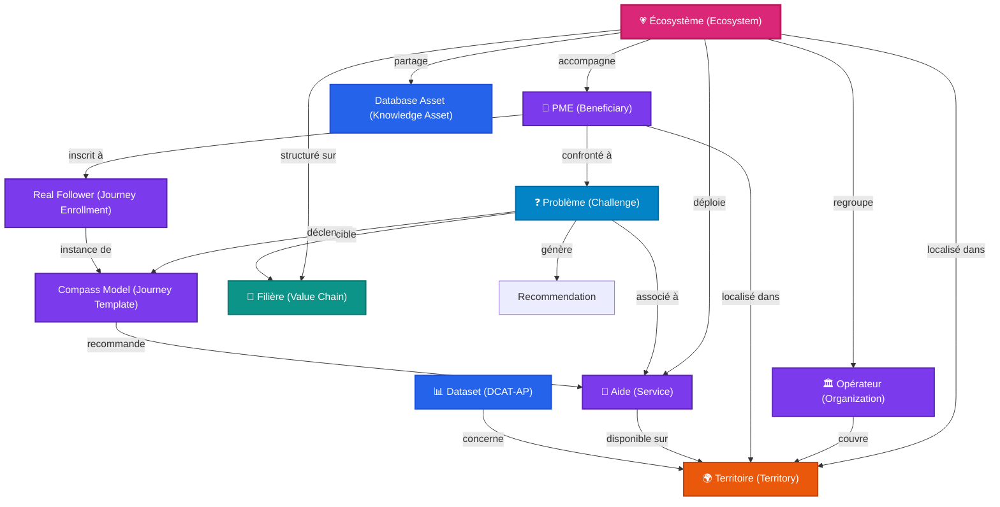

# 🌐 Plateforme d'Intelligence Territoriale (PIT) — Architecture Cible v3.0
## Référentiel Unique d'Architecture & de Conception (Target Architecture)

Ce document constitue le référentiel d'architecture cible officiel et définitif de la **Plateforme d'Intelligence Territoriale (PIT)**. Il définit les concepts clés, la structure du graphe de connaissances territorial, le modèle de domaine unifié, les référentiels sémantiques transverses, la couche d'intelligence territoriale et la feuille de route stratégique du projet.

---

## 🌟 1. Vision Cible & Principes Directeurs

La PIT a pour vocation de devenir la **Knowledge Graph Platform** de référence de la Région wallonne pour l'accompagnement des entreprises, l'alignement stratégique des aides publiques et le pilotage de la Stratégie de Spécialisation Intelligente (S3).

### Objectifs Stratégiques
1.  **Désensibiliser et unifier l'accès à l'information** : Offrir aux conseillers et aux PME wallonnes une vision unifiée de l'écosystème d'aides (Diagnostics, Subventions, Formations) par-delà les frontières organisationnelles.
2.  **Mesurer l'impact de l'action publique** : Suivre en temps réel la transformation des entreprises à travers des indicateurs de maturité (DR-BEST) corrélés avec les dépenses, les territoires et les activités d'écosystème.
3.  **Préparer l'orientation automatisée par IA** : Fournir une base de connaissances sémantique (Graphe de Connaissances en JSON-LD / RDF) exploitable par des agents conversationnels internes et externes sans risque d'hallucination.

### Principes d'Architecture
*   **Semantic-First** : Toute entité métier doit hériter d'un socle d'attributs communs et être définie par une URI unique reliée à un concept ou à une classe d'une ontologie de référence.
*   **Decoupled Cockpit Pattern** : Séparation stricte entre les catalogues bruts d'actifs (les Services, les Datasets) et la logique d'orchestration (les Parcours, les Recommandations).
*   **Zero-Data Loss & DB-Backed Persistence** : Les configurations métiers, les formulaires d'édition, les jalons et les parcours sont entièrement persistés en base de données relationnelle et transactionnelle.

---

## 🕸️ 2. Territorial Knowledge Graph

Le cœur de la plateforme repose sur un **Graphe de Connaissances Territorial**. Ce graphe modélise les entités économiques, géographiques et sémantiques du territoire wallon comme des nœuds, et leurs relations logiques comme des arcs typés. 

Dans cette architecture cible, l'**Écosystème** (`Ecosystem`) et le **Besoins** (`Challenge`) occupent une position centrale, servant de nœuds fédérateurs avec le **Territoire** (`Territory`).

### Le Modèle de Relations Générique (`EntityRelation`)
Plutôt que d'avoir uniquement des liaisons dures et fixes en base de données, les relations du Territorial Knowledge Graph sont pilotées par le modèle dynamique `EntityRelation`.

#### Attributs d'une relation :
*   `sourceEntity` : URI / ID de l'entité source (ex: `ORG-ADN`).
*   `targetEntity` : URI / ID de l'entité cible (ex: `SVC-DIAG`).
*   `relationType` : Type de prédicat sémantique (ex: `PROVIDES`, `RECOMMENDS`, `COVERS`, `LOCATED_IN`, `TRIGGERS`).
*   `strength` : Poids / Intensité de la liaison (0.0 à 1.0).
*   `confidence` : Indice de certitude sémantique ou algorithmique (0.0 à 1.0).
*   `validFrom` & `validTo` : Période temporelle de validité.

---

## 🧬 3. Domain Model Cible

Toutes les entités de la plateforme PIT héritent d'une classe de base unique appelée `BaseEntity`, assurant la cohérence structurelle et la traçabilité de l'ensemble du graphe.

### Diagramme de Classes (UML Model)

```mermaid
classDiagram
    class BaseEntity {
        <<Abstract>>
        +Int id
        +String uri
        +String name
        +String description
        +String status
        +String[] tags
        +String owner
        +DateTime createdAt
        +DateTime updatedAt
    }

    class Organization {
        +String type
    }
    class Beneficiary {
        +String bce
        +String size
        +Int maturityD
        +Int maturityR
        +Int maturityB
        +Int maturityE
        +Int maturityS
        +Int maturityT
    }
    class Service {
        +String code
        +InterventionType type
    }
    class JourneyTemplate {
        +String provider
        +String objective
        +String[] targetAudience
    }
    class JourneyStage {
        +Int position
    }
    class JourneyEnrollment {
        +String status
        +Float completionRate
    }
    class JourneyOutcome {
        +String indicatorMeasured
    }
    class JourneyTrigger {
        +String eventCode
    }
    class JourneyRecommendationRule {
        +String ruleLogic
    }
    class Program {
        +Float budget
        +DateTime startDate
        +DateTime endDate
    }
    class Project {
        +String status
    }
    class Action {
        +DateTime dueDate
    }
    class Activity {
        +InterventionType type
        +DateTime date
        +Int participantsCount
        +Float satisfactionScore
    }
    class Ecosystem {
        +EcosystemType type
    }
    class S3Domain {
        +String code
    }
    class ValueChain {
        +String code
    }
    class ValueChainStage {
        +String category
        +Int position
    }
    class Dataset {
        +String format
        +String distributionUri
    }
    class KnowledgeAsset {
        +String type
    }
    class Indicator {
        +String metricCode
        +Float targetValue
        +Float currentValue
    }
    class ImpactDimension {
        +String category
    }
    class ImpactMeasurement {
        +Float value
        +String unit
        +DateTime measuredAt
    }
    class Challenge {
        +String code
    }
    class ChallengeCategory {
        +String code
    }
    class Territory {
        +String code
        +String type
    }
    class EntityRelation {
        +String sourceEntity
        +String targetEntity
        +String relationType
        +Float strength
        +Float confidence
        +DateTime validFrom
        +DateTime validTo
    }

    BaseEntity <|-- Organization
    BaseEntity <|-- Beneficiary
    BaseEntity <|-- Service
    BaseEntity <|-- JourneyTemplate
    BaseEntity <|-- JourneyStage
    BaseEntity <|-- JourneyEnrollment
    BaseEntity <|-- JourneyOutcome
    BaseEntity <|-- JourneyTrigger
    BaseEntity <|-- JourneyRecommendationRule
    BaseEntity <|-- Program
    BaseEntity <|-- Project
    BaseEntity <|-- Action
    BaseEntity <|-- Activity
    BaseEntity <|-- Ecosystem
    BaseEntity <|-- S3Domain
    BaseEntity <|-- ValueChain
    BaseEntity <|-- ValueChainStage
    BaseEntity <|-- Dataset
    BaseEntity <|-- KnowledgeAsset
    BaseEntity <|-- Indicator
    BaseEntity <|-- ImpactDimension
    BaseEntity <|-- ImpactMeasurement
    BaseEntity <|-- Challenge
    BaseEntity <|-- ChallengeCategory
    BaseEntity <|-- Territory
    
    S3Domain "1" *-- "many" ValueChain : contains
    ValueChain "1" *-- "many" ValueChainStage : contains
    ChallengeCategory "1" *-- "many" Challenge : classifies
    JourneyTemplate "1" *-- "many" JourneyStage : contains
    JourneyTemplate "1" *-- "many" JourneyEnrollment : followed_by
    JourneyTemplate "1" *-- "many" JourneyOutcome : achieves
    JourneyTemplate "1" *-- "many" JourneyTrigger : triggered_by
    JourneyTemplate "1" *-- "many" JourneyRecommendationRule : guided_by
    ImpactDimension "1" *-- "many" ImpactMeasurement : defines
```

### Descriptions Techniques des Classes Cibles

1.  **`BaseEntity`** : Classe parente abstraite de toutes les entités. Elle fournit l'identifiant système, l'URI sémantique globale, le cycle de vie (`status`), les mots-clés (`tags`), la propriété technique (`owner`), et la traçabilité temporelle (`createdAt`, `updatedAt`).
2.  **`Organization`** : Représente les administrations et opérateurs d'accompagnement (ex: Agence du Numérique).
3.  **`Beneficiary`** : Profil 360° d'une PME wallonne. Elle contient les indices de maturité correspondant à chacun des 6 axes du référentiel **DR-BEST** (Data, Remote, Business, Ecosystem, Skills, Technology).
4.  **`Service`** : Fiche d'accompagnement public CPSV-AP, classifiée selon son type d'intervention (`InterventionType`).
5.  **`JourneyTemplate`** : Modèle théorique de parcours d'accompagnement type composé d'étapes recommandées.
6.  **`JourneyStage`** : Étape ou maillon opérationnel du parcours (ex: Amorçage, Diagnostic).
7.  **`JourneyEnrollment`** : Instance réelle d'engagement d'une entreprise bénéficiaire dans un parcours.
8.  **`JourneyOutcome`** : Résultat direct attendu ou observé à la fin d'un parcours (ex: Taux de complétion, Jalon TRL validé).
9.  **`JourneyTrigger`** : Événement ou Challenge spécifique déclenchant le parcours.
10. **`JourneyRecommendationRule`** : Règle de décision sémantique ou algorithmique recommandant le parcours à un bénéficiaire.
11. **`Program`** : Dispositif public de financement à grande échelle (ex: Plan Relance Wallonie).
12. **`Project`** : Initiative locale ou projet pilote mené par un consortium.
13. **`Action`** : Jalon de projet ou action opérationnelle.
14. **`Activity`** : Prestation réalisée (Individuelle, Collective, Écosystème) et classifiée par `InterventionType`.
15. **`Ecosystem`** : Nœud central fédérant les acteurs, projets, et actifs sémantiques.
16. **`S3Domain`** : Domaine d'innovation prioritaire de la spécialisation intelligente (ex: Agroalimentaire).
17. **`ValueChain`** : Filière d'innovation spécifique (ex: Transformation Alimentaire, Construction Circulaire).
18. **`ValueChainStage`** : Maillon opérationnel précis d'une chaîne de valeur (ex: Réemploi, Production).
19. **`Dataset`** : Fiche descriptive de catalogue de données conforme au standard DCAT-AP.
20. **`KnowledgeAsset`** : Actif de connaissance territoriale (ex: ontologies, modèles IA, thésaurus).
21. **`Indicator`** : Métrique d'évaluation de la performance (KPI).
22. **`ImpactDimension`** : Axe d'impact de l'action publique (ex: Décarbonation, Circularité).
23. **`ImpactMeasurement`** : Mesure unitaire et chiffrée de l'impact associé à une `ImpactDimension`.
24. **`Challenge`** : Problématique d'affaires ou technique que l'entreprise cherche à résoudre (ex: Adoption IA).
25. **`ChallengeCategory`** : Catégorisation logique des défis.
26. **`Territory`** : Délimitation et nœud géographique d'intelligence territoriale.
27. **`EntityRelation`** : Représente une relation dynamique et pondérée dans le graphe de connaissances.

---

## 📊 4. Taxonomies & Alignements Métiers

La PIT s'appuie sur quatre grands référentiels taxonomiques pour catégoriser ses actifs et réaliser le matchmaking automatique.

### A. Le Cadre de Maturité DR-BEST (EDIH Officiel)
Le framework officiel DR-BEST sert à classifier l'ensemble des **Services**, **Parcours**, **Activités**, **Programmes**, **Offres EDIH** et **Capabilités d'accompagnement** du territoire :
*   **D = Data** : Diagnostics de données, valorisation des bases de données de l'entreprise.
*   **R = Remote** : Travail collaboratif à distance, outils décentralisés, gestion de flotte à distance.
*   **B = Business** : Stratégie d'affaires, business models numériques, rentabilité et coaching.
*   **E = Ecosystem** : Animation de cluster, réseautage d'opérateurs, synergie inter-entreprises.
*   **S = Skills** : Formations aux outils numériques, upskilling de la main d'œuvre, formation à l'IA.
*   **T = Technology** : Test Before Invest, implémentation technique IoT/Cyber, virtualisation, cloud.

### B. Le Modèle Hiérarchique S3 (Smart Specialisation Strategy)
L'alignement S3 de la Wallonie est structuré selon une hiérarchie stricte en 3 niveaux :
$$\text{S3 Domain} \implies \text{Value Chain} \implies \text{Value Chain Stage}$$
*   *Exemple 1* : Agroalimentaire ➔ Transformation Alimentaire ➔ Production
*   *Exemple 2* : Construction Durable ➔ Construction Circulaire ➔ Réemploi

### C. La Taxonomie des Défis (`Challenge`)
Cette taxonomie modélise les problématiques directes rencontrées par les PME.
*   **Valeurs initiales** : *Transformation Digitale, Adoption IA, Cybersécurité, Recherche de financement, Décarbonation, Circularité, Export, Croissance, Recrutement, Montée en compétences, Industrie 4.0, Conformité réglementaire, Gestion des données*.
*   **Logique de propagation** :
$$\text{Challenge (Adoption IA)} \implies \text{Capability (AI)} \implies \text{Services (Diag IA)} \implies \text{Journey (Parcours IA PME)}$$

### D. Le Référentiel des Territoires (`Territory`)
Une hiérarchie géographique imbriquée permettant le raisonnement spatial :
$$\text{Europe} \implies \text{Belgique} \implies \text{Wallonie} \implies \text{Province} \implies \text{Bassin économique} \implies \text{Commune} \implies \text{Zone d'activité}$$

### E. Typologie des Écosystèmes (`EcosystemType`)
Spécialisation des clusters et structures territoriales :
$$\text{Cluster, Pôle de compétitivité, Communauté, Réseau, Partenariat,}$$
$$\text{Plateforme, Programme collaboratif, Living Lab, EDIH, Hub}$$

---

## 🏛️ 5. Territorial Intelligence Layer (Requêtes Décisionnelles)

La couche d'intelligence territoriale de la PIT exploite les relations du graphe pour répondre à des requêtes stratégiques transversales :

*   *Couverture des Besoins* : "Quels services couvrent le challenge *Cybersécurité* sur le territoire de la *Province de Liège* ?"
*   *Analyse d'Acteurs* : "Quels opérateurs et écosystèmes détiennent la capability *Digital Twin* sur le maillon *Conception* de la filière *Industrie 4.0* ?"
*   *Détection de Zones Blanches* : "Quels territoires ou communes manquent d'aides de type *Test Before Invest* ?"
*   *Évaluation d'Impact* : "Quels modèles de parcours (`JourneyTemplate`) enregistrent le plus fort taux de complétion et de gain DR-BEST ?"

---

## 🗂️ 6. Mappings de Référentiels Européens (European Alignment Matrix)

La plateforme assure une conformité stricte avec les standards du W3C et du SEMIC européen pour l'interopérabilité des données territoriales.

| Concept PIT | Standard Européen | Rôle de l'Alignement |
| :--- | :--- | :--- |
| **`Service`** | **CPSV-AP v3.0** | Modélisation normalisée des fiches descriptives des services d'aides. |
| **`Dataset`** | **DCAT-AP** | Modélisation des catalogues de données partagées du territoire. |
| **`Organization`** | **W3C ORG** | Représentation standardisée des organisations publiques et privées. |
| **`Territory`** | **LOCN** | Représentation sémantique des adresses et de la géographie (W3C Location). |
| **`JourneyTemplate`**| **D4WMO Extension** | Ontologie de maturité wallonne étendue pour l'enchaînement de maillons. |
| **`JourneyEnrollment`**| **D4WMO Extension** | Suivi d'avancement réel et de progression individuelle de maturité. |
| **`Challenge`** | **Extension PIT** | Taxonomie wallonne modélisant les défis métiers d'affaires. |
| **`Ecosystem`** | **Extension PIT** | Structure sémantique du réseau de clusters et d'offres EDIH. |
| **`Capability`** | **EDIH / AI Ecosystem** | Classification harmonisée des compétences technologiques de l'Europe. |
| **`S3Domain`** | **Smart Specialisation**| Nomenclature européenne pour le pilotage des fonds de recherche S3. |

---

## 🎨 7. Design System PIT (Cockpit Unified Pattern)

L'expérience utilisateur repose sur un ensemble de composants unifiés au style *Glassmorphism* (effets de flou d'arrière-plan, bordures semi-transparentes, thème sombre premium par défaut).

1.  **`PITLayout`** : Conteneur principal de la page. Gère le menu de navigation latérale de l'Observatoire Territorial, les barres d'outils d'en-tête, le fil d'Ariane et l'intégration de la barre d'onglets de la page.
2.  **`PITDetailLayout`** : Structure asymétrique divisant l'espace écran (1/3 pour la navigation latérale filtrable des entités, 2/3 pour le cockpit de détails).
3.  **`PITTabs`** : Composant d'onglets horizontaux avec variantes (pills/underlined), prenant en charge l'affichage d'icônes lucide-react et de badges numériques contextuels.
4.  **`PITForm`** : Structure de formulaire standardisée comprenant la gestion des sections collapsibles, le style des checkboxes, inputs de saisie textuelle et l'auto-complétion.
5.  **`PITEntityCard`** : Carte d'entité sémantique. Affiche le titre de l'élément, sa description, ses relations sous forme de badges colorés, et des actions d'édition/suppression rapides.
6.  **`PITGraphView`** : Composant de rendu réseau interactif s'appuyant sur ReactFlow, configuré pour mettre en valeur les nœuds sélectionnés par des outlines brillants animés (couleur teal `#14b8a6`).

---

## 🗺️ 8. Feuille de Route Stratégique (Target Roadmap)

La transformation de la PIT s'articulera autour de 6 chantiers prioritaires :

1.  **Services** : Couverture à 100% de l'ensemble des aides de la Région wallonne modélisées en standard CPSV-AP. Intégration de formulaires d'aide à la saisie assistés par IA.
2.  **Parcours** : Consolidation des parcours multi-opérateurs (WE + AdN + AWEX) persistés en base de données avec alertes de blocage de PME.
3.  **Écosystèmes** : Rattachement sémantique des pôles de compétitivité (MecaTech, Tweed, BioWin, Logistics in Wallonia) pour identifier leurs membres actifs sur la chaîne de valeur.
4.  **Knowledge Graph** : Exposition des points d'accès sémantiques (SPARQL endpoint) et exports normalisés en JSON-LD pour l'interopérabilité avec les instances fédérales belges et européennes.
5.  **Recommender** : Intégration d'un module d'IA générative locale (RAG s'appuyant sur le Knowledge Graph) permettant aux conseillers de poser des questions en langage naturel.
6.  **Impact** : Module d'analyse macro-économique corrélant l'utilisation des enveloppes budgétaires régionales avec la progression nette des scores de maturité DR-BEST des PME accompagnées.
