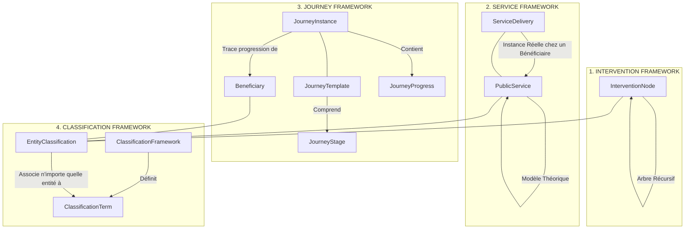

# ARCHITECTURE GLOBAL DE LA PIT vNext (RÉVOLUTION TECHNIQUE)

Ce document décrit la refonte globale de la Plateforme d'Interopérabilité Territoriale (PIT) vers un modèle modulaire générique à 4 piliers, conçu pour unifier le pilotage territorial (EDIH, S3, Plan de Relance, etc.) sous un schéma de données et de recommandation commun.

---

## 1. VISION DE LA vNext : DU MODÈLE RIGI DE À L'INTEROPÉRABILITÉ TOTALE

Les itérations précédentes de la PIT reposaient sur une hiérarchie d'intervention fixe et des référentiels codés en dur (DR-BEST). Cette approche posait trois limites :
1. **Rigidité structurelle** : Impossible d'héberger conjointement des programmes complexes comme la S3 (8 niveaux de hiérarchie) et des projets simples (2 niveaux).
2. **Surreprésentation de DR-BEST** : Utilisé comme axe structurant de parcours alors qu'il ne s'agit que d'un référentiel de qualification transversale parmi d'autres (NACE, TRL, DMAT...).
3. **Parcours figés** : Limités à une seule séquence type, empêchant d'avoir des parcours spécifiques à l'IA, la cybersécurité ou l'exportation.

Le modèle cible vNext est découpé en 4 frameworks orthogonaux :

---

## 2. LES 4 CADRES MÉTIER (FRAMEWORKS)

### A. Intervention Framework (Cadre d'Intervention)
Unifie toutes les structures d'actions publiques (stratégies, programmes, projets, jalons, activités) sous une entité unique et récursive : `InterventionNode`. Chaque node possède un type et un parent, permettant de modéliser des arbres de gouvernance de n'importe quelle profondeur (ex: S3, FEDER, Plan de Relance).

### B. Service Framework (Cadre des Services)
Garde l'entité centrale `PublicService` conforme à la norme CPSV-AP de la Commission Européenne. Introduit l'entité `ServiceDelivery` pour distinguer la fiche descriptive du service théorique et les livraisons réelles réalisées pour les bénéficiaires (ex: Diagnostic Cybersécurité réalisé pour Dupont S.A.).

### C. Journey Framework (Cadre des Parcours)
Permet de définir des modèles de parcours sectoriels ou technologiques (`JourneyTemplate`) associés à des étapes ordonnées (`JourneyStage`). L'inscription d'un bénéficiaire génère une instance de parcours (`JourneyInstance`) dont l'avancement jalonné est consigné via `JourneyProgress`.

### D. Classification Framework (Cadre de Qualification)
Le moteur sémantique de la PIT vNext. Unifie toutes les taxonomies (DR-BEST, S3, NACE, TRL, DMAT, DigComp) sous un modèle générique de termes (`ClassificationTerm`) organisés au sein de référentiels (`ClassificationFramework`). N'importe quel objet de la base de données peut être tagué par un terme via l'entité de liaison `EntityClassification`.

---

## 3. IMPACT SUR LE MOTEUR DE RECOMMANDATION

L'algorithme de recommandation n'utilise plus les dimensions DR-BEST pour calculer la suite d'un parcours. La logique vNext s'articule ainsi :
1. **Identification du template** de parcours cible pour le bénéficiaire (ex: Parcours Cyber).
2. **Calcul de l'étape active** (`JourneyProgress` en statut `TODO` ou `IN_PROGRESS`).
3. **Sélection des services prioritaires** : Recherche des services publics associés à l'étape active et à l'étape suivante, puis filtrage fin par les classifications communes (ex: TRL ou niveau de maturité).
