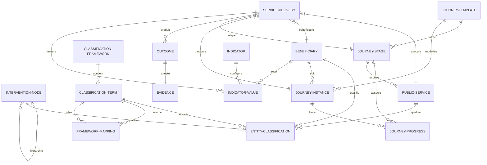

# SYNTHÈSE DE L'ARCHITECTURE D'ENTREPRISE (PIT vNext - PHASE 0)

Ce document présente la synthèse de la **Phase 0** de consolidation architecturale de la PIT vNext. Il formalise comment les nouveaux concepts (Business Views, Framework Mappings, Outcomes) s'intègrent et complètent les frameworks existants pour former un **Territorial Knowledge Graph** unifié et cohérent.

---

## 1. CARTOGRAPHIE INTÉGRÉE DES NOEUDS DE DONNÉES (THE KNOWLEDGE GRAPH)

La PIT vNext n'est plus un catalogue de données relationnelles cloisonnées. C'est un graphe sémantique interconnecté capable de lier des politiques publiques à des impacts individuels réels de PME :

---

## 2. MODÈLE D'INTEGRATION DES NOUVEAUX CONCEPTS

### A. Intégration des Business Views (Couche de Projection)
Les **Business Views** agissent comme une lentille sémantique au-dessus du graphe.
* *Liens techniques* : Elles effectuent des sélections dynamiques sur `InterventionNode` (pour la structure), `EntityClassification` (pour le domaine technologique/métier comme la S3) et `IndicatorValue` (pour calculer les statistiques d'impact).
* *Exemple* : La vue "Circular Wallonia" filtre les nodes d'interventions liés aux axes de décarbonation, identifie les PME classifiées sous le code NACE d'économie circulaire et somme les indicateurs de réduction CO2.

### B. Intégration du Framework Mapping (Graphe de Références)
Le **Framework Mapping** relie les taxonomies transversales de qualification.
* *Liens techniques* : La table `FrameworkMapping` crée des ponts typés (ex: `ENABLES`, `IMPLEMENTS`) directement entre les enregistrements de la table `ClassificationTerm`.
* *Exemple* : Une compétence `Computer Vision` (framework AI-Taxonomy) possède un mapping `ENABLES` vers le domaine `S3-INDUSTRIE-FUTUR`.

### C. Intégration de l'Outcome & Evidence Framework (Mesure de Valeur)
Ce framework trace le ROI et l'impact de chaque jalon d'accompagnement.
* *Liens techniques* : Les tables `Outcome`, `Evidence` et `IndicatorValue` sont associées à `ServiceDelivery` (qui représente la prestation effective délivrée d'un `PublicService` au `Beneficiary`).
* *Exemple* : La livraison d'un service d'accompagnement se solde par un `Outcome` de type "Attestation DMAT générée", validé par une `Evidence` physique (fichier PDF de l'audit) et enregistrant des indicateurs de maturité.

### D. Intégration du Data Source Framework (Gouvernance et Provenance)
Ce framework formalise la traçabilité de l'origine et de la souveraineté de chaque donnée stockée dans le graphe.
* *Liens techniques* : La table `DataSourceMetadata` s'associe de manière polymorphique à toute entité clé (`Beneficiary`, `ServiceDelivery`, `InterventionNode`, etc.).
* *Exemple* : Les données d'une PME sont marquées avec `sourceSystem: BCE` et `authoritative: true`, interdisant l'édition manuelle locale dans la PIT et garantissant que l'information provient de la source légale officielle. Voir [PIT_DATA_SOURCE_FRAMEWORK.md](file:///c:/Users/Philippe%20Pisetta/Downloads/testing%20CPSV-AP/docs/architecture/PIT_DATA_SOURCE_FRAMEWORK.md) pour les détails.

### E. Intégration de la Semantic Identifier Strategy (Identité Globale)
Cette stratégie prépare l'exportation et l'interopérabilité directe de la PIT vNext vers le web sémantique.
* *Liens techniques* : Ajout d'un attribut `semanticId` unique (indexé) sur toutes les tables de classification, de parcours, d'interventions et de prestations.
* *Exemple* : Le `ClassificationTerm` de code `NACE-6202` possède le `semanticId: http://data.europa.eu/ux2/nace2/6202`, permettant aux APIs JSON-LD ou NGSI-LD de l'exporter sans réconciliation manuelle des clés physiques. Voir [PIT_SEMANTIC_IDENTIFIER_STRATEGY.md](file:///c:/Users/Philippe%20Pisetta/Downloads/testing%20CPSV-AP/docs/architecture/PIT_SEMANTIC_IDENTIFIER_STRATEGY.md) pour les détails.

---

## 3. SYNTHÈSE DES COMPOSANTS PHYSIQUES (CIBLE VS TRANSITOIRE)

| Concept Métier | Modèle Physique Transitoire (MVP Actuel) | Modèle Physique Cible (PIT vNext) | Rôle dans le Graphe de Connaissances |
| :--- | :--- | :--- | :--- |
| **Gouvernance & Stratégies** | `Program`, `Project`, `Action`, `Activity` | `InterventionNode` (Arbre récursif) | Structure le contexte réglementaire et budgétaire de l'action publique. |
| **Offres de Services** | `PublicService` (CPSV-AP) | `PublicService` | Définit l'offre théorique et les compétences de l'opérateur. |
| **Prestations Réelles** | Non modélisé (ou confondu avec `Activity`) | `ServiceDelivery` | Trace l'acte de délivrance du service à un bénéficiaire. |
| **Parcours Types** | `Journey` (Linéaire) | `JourneyTemplate` + `JourneyStage` | Modélise les chemins de transformation sectoriels et technologiques théoriques. |
| **Parcours Clients** | `JourneyEnrollment` | `JourneyInstance` + `JourneyProgress` | Enregistre l'avancement chronologique réel d'une PME sur un parcours. |
| **Référentiels & Taxonomies**| `S3Domain`, `NaceSector` (Tables multiples) | `ClassificationFramework` + `ClassificationTerm` | Unifie toutes les grilles de lecture et de taggage (S3, TRL, TRL, DigComp). |
| **Liaisons Sémantiques** | Relations Prisma physiques | `EntityClassification` + `FrameworkMapping` | Interconnecte et corrèle toutes les entités et taxonomies entre elles. |
| **Mesure & ROI** | Attributs de texte brut | `Outcome` + `Evidence` + `Indicator` | Apporte la preuve physique et la mesure quantitative des résultats. |
| **Gouvernance des Données** | Non modélisé | `DataSourceMetadata` (SoR) | Trace la provenance, l'autorité de modification et la dernière date de synchro. |
| **Identité Sémantique** | Identifiants locaux auto-incrémentés (`Int`) | Champ `semanticId` unique (`String`) | Assure l'interopérabilité directe avec GraphDB (RDF), JSON-LD et NGSI-LD. |

---

## 4. SCHEMA ET CONCEPET DES SCHÉMAS HIÉRARCHIQUES (INTERVENTION PATTERNS)

Le Territorial Knowledge Graph doit comprendre les règles de validation structurelles propres à chaque stratégie d'intervention territoriale. C'est l'objectif du concept d'**InterventionPattern**.

* **Définition** : Un `InterventionPattern` est un schéma de validation structurel qui régit l'arborescence des types de noeuds (`InterventionNodeType`) autorisés dans un contexte stratégique donné.
* **Exemples de Patterns** :
  * `S3_PATTERN` : `STRATEGY` → `PRIORITY` → `OBJECTIVE` → `MEASURE` → `INITIATIVE` → `PROGRAM` → `PROJECT` → `ACTION` → `ACTIVITY`.
  * `EDIH_PATTERN` : `PROGRAM` → `MEASURE` (Service Portfolio) → `ACTION` → `ACTIVITY`.
  * `CIRCULAR_PATTERN` : `STRATEGY` → `PRIORITY` (Axe) → `OBJECTIVE` → `MEASURE` → `INITIATIVE` → `ACTION` → `ACTIVITY`.
* **Impacts et Usages Futurs** :
  * **Validation dynamique** : Empêche la création d'un projet (`PROJECT`) orphelin ou attaché directement à une stratégie (`STRATEGY`) sans passer par les niveaux de priorité ou de mesure requis par le pattern.
  * **Génération dynamique d'UI** : Les formulaires de saisie de la PIT s'adaptent dynamiquement (changement des boutons d'ajout de sous-niveaux) selon le pattern stratégique sélectionné à la racine de l'arborescence.

---

## 5. BÉNÉFICE MAJEUR POUR LE TERRITOIRE

Grâce à cette consolidation de la Phase 0, la PIT vNext dispose d'une fondation solide pour :
1. **Prouver scientifiquement l'impact** des financements publics (ex: relier 1 million d'euros de subsides FEDER à 350 ETP créés et 400 tonnes de CO2 économisées).
2. **Fournir des préconisations auto-explicatives** et hautement pertinentes aux entrepreneurs wallons.
3. **Offrir une plateforme ouverte et extensible** capable d'accueillir n'importe quel futur plan ou politique territoriale sans nécessiter de développements de base de données complémentaires.
