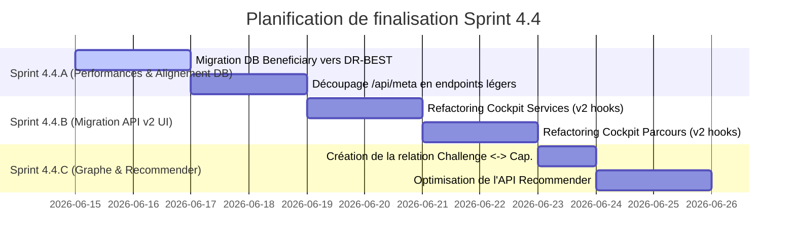

# 🔍 Audit de Couverture UI & Analyse d'Écart — PIT Wallonie (Sprint 4.4)

Ce document présente l'audit exhaustif et factuel de la couverture utilisateur (UI), sémantique et technique de la **Plateforme d'Intelligence Territoriale (PIT) en Wallonie**, comparant l'état réel de l'implémentation (v10.0 + Sprint 4.3) aux spécifications cibles de l'architecture PIT.

---

## 📅 ÉTAPE 1 – INVENTAIRE DES ROUTES NEXT.JS

L'analyse de l'arborescence Next.js de l'application `cpsv-ap-app/src/app` révèle les routes réelles suivantes :

| Route | Existe | Statut | Observations |
| :--- | :---: | :---: | :--- |
| `/` | **Oui** | Implémentée | Tableau de bord territorial unifié (KPIs, répartition cartographique, etc.). |
| `/programs` | **Oui** | Implémentée | Cockpit Programmes (liste, détails, relations, graphe et PITImpactPanel). |
| `/projects` | **Non** | Non implémentée | Pas de route indépendante. Partiellement accessible dans `/programs` via les tiroirs. |
| `/actions` | **Non** | Non implémentée | Pas de route indépendante. Partiellement accessible dans `/programs` via les tiroirs. |
| `/activities` | **Oui** | Implémentée | Cockpit Prestations (Individuel, Collectif, Structure/Deuxième ligne). |
| `/capabilities` | **Oui** | Implémentée | Cockpit Capabilités (compétences technologiques et relations sémantiques). |
| `/challenges` | **Non** | Non implémentée | Pas de route dédiée. Présent comme taxonomie transverse dans les filtres. |
| `/services` | **Oui** | Implémentée | Cockpit Services CPSV-AP (liste, détails et relations) avec wizard d'encodage custom. |
| `/services/encode` | **Oui** | Implémentée | Wizard d'encodage de services CPSV-AP multilatéral. |
| `/journeys` | **Oui** | Implémentée | Cockpit Parcours (Modèles de parcours et enrôlement des PME). |
| `/beneficiaries` | **Oui** | Implémentée | Cockpit Bénéficiaires (fiche PME 360°, maturité et historique d'accompagnement). |
| `/organizations` | **Non** | Non implémentée | Pas de route dédiée. Les organisations sont gérées dans les référentiels et métadonnées. |
| `/territories` | **Non** | Non implémentée | Pas de route dédiée. Les échelles territoriales sont utilisées comme filtres. |
| `/ecosystems` | **Oui** | Implémentée | Cockpit Écosystèmes (Hubs numériques, clusters et acteurs rattachés). |
| `/s3` | **Oui** | Implémentée | Observatoire S3 (Alignement par Domaine, Filière, et Maillon S3). |
| `/datasets` | **Oui** | Implémentée | Catalogue de Données DCAT-AP (jeux de données et conformité européenne). |
| `/graph` | **Oui** | Implémentée | Explorateur de Graphe Sémantique interactif complet (Vis.js). |
| `/recommender` | **Oui** | Implémentée | Recommender (Moteur de matchmaking IA d'aides publiques basé sur la maturité). |
| `/pilotage` | **Oui** | Implémentée | Module de Pilotage Stratégique (5 Questions de pilotage). |
| `/strategies` | **Oui** | Implémentée | Cockpit Politiques Stratégiques (S3, Circular Wallonia, Plan de Relance). |
| `/value-chains` | **Oui** | Implémentée | Interface d'alignement des filières S3 et des entreprises. |
| `/knowledge-assets` | **Oui** | Implémentée | Référentiel des actifs de connaissances (guides, questionnaires de diagnostic). |
| `/settings` | **Oui** | Non implémentée | Page statique placeholder (indique que la configuration sera disponible en vNext). |
| `/guide` | **Oui** | Implémentée | Guide d'utilisation interactif (8 étapes de la méthodologie PIT). |

---

## 🏛️ ÉTAPE 2 – INVENTAIRE DES COCKPITS

Pour chaque cockpit PIT cible, nous mesurons l'état de l'implémentation de ses écrans et fonctionnalités :

| Cockpit | Liste | Détail | Relations | Impact | Graphe | Filtres / Recherche / Pagination |
| :--- | :---: | :---: | :---: | :---: | :---: | :--- |
| **Programs** | **OK** | **OK** | **OK** | **OK** | **OK** | Recherche (nom), filtres (S3), pagination (projets). |
| **Projects** | *Partiel* | *Partiel* | **OK** | *Absent* | *Absent* | Pas de filtres/recherche autonomes. Sub-pagination (actions). |
| **Actions** | *Partiel* | *Partiel* | **OK** | *Absent* | *Absent* | Pas de filtres/recherche autonomes. Sub-pagination (activités). |
| **Activities** | **OK** | **OK** | **OK** | *Absent* | *Absent* | Recherche (libre), filtres (onglets), pas de pagination. |
| **Challenges** | *Partiel* | *Absent* | **OK** | *Absent* | *Absent* | Pas de filtres/recherche/pagination. |
| **Capabilities**| **OK** | **OK** | **OK** | **OK** | **OK** | Recherche (nom), pas de filtres, pas de pagination. |
| **Services** | **OK** | **OK** | **OK** | **OK** | **OK** | Recherche (libre), filtres (Thème, S3), pas de pagination (Virtualisé). |
| **Journeys** | **OK** | **OK** | **OK** | **OK** | *Absent* | Recherche (nom), filtres (S3, Défis, Écosystèmes), pas de pagination. |
| **Beneficiaries**| **OK** | **OK** | **OK** | *Partiel* | *Absent* | Recherche (nom, NACE, province), pas de filtres, pas de pagination (Virtualisé). |
| **Organizations**| *Absent* | *Absent* | **OK** | *Absent* | *Absent* | Pas de filtres/recherche/pagination. |
| **Territories** | *Absent* | *Absent* | **OK** | *Absent* | *Absent* | Pas de filtres/recherche/pagination. |
| **Ecosystems** | **OK** | **OK** | **OK** | *Absent* | *Absent* | Recherche (nom, territoire), pas de filtres, pas de pagination. |
| **S3** | **OK** | **OK** | **OK** | *Absent* | *Absent* | Pas de filtres/recherche/pagination. |
| **DR-BEST** | *Absent* | *Absent* | **OK** | **OK** | *Absent* | Pas de filtres/recherche/pagination. |
| **Datasets** | **OK** | **OK** | **OK** | *Absent* | *Absent* | Recherche (titre/description), filtres (Thèmes), pas de pagination. |
| **Graph Explorer**| *N/A* | **OK** | **OK** | *Absent* | **OK** | Recherche (nom de nœud), filtres (Type de nœud), pas de pagination. |

> [!NOTE]
> * **Projets, Actions et Organisations** sont accessibles sous forme de volets latéraux ou de cartes relationnelles imbriquées dans les cockpits principaux, mais ne disposent pas d'écrans dédiés.
> * **Pagination** : Seules les listes imbriquées du Cockpit `Programs` (projets, actions, activités) exploitent une pagination serveur réelle. Les autres listes s'appuient sur un rendu virtuel (`PITVirtualList`) ou chargent l'ensemble de la table en mémoire.

---

## 🔌 ÉTAPE 3 – INVENTAIRE DES APIS UTILISEES

L'audit des connexions réseaux au sein des conteneurs UI et des hooks TanStack Query a permis de lister les endpoints réels appelés :

| Cockpit | API v2 (Express port 3001) | Legacy / Next.js API (Port 3000) | Statut & Dépendances V10 |
| :--- | :--- | :--- | :--- |
| **Programs** | `/api/v2/programs`, `/api/v2/programs/:id`, `/api/v2/programs/:id/projects`, `/api/v2/projects/:id/actions`, `/api/v2/actions/:id/activities`, `/api/v2/s3-domains`, `/api/v2/graph/programs/:id`, `/api/v2/programs/:id/contributions` | *Néant* | **100% v2**. Aucune dépendance legacy v10. |
| **Capabilities**| `/api/v2/capabilities`, `/api/v2/services`, `/api/v2/journeys`, `/api/v2/challenges`, `/api/v2/graph/capabilities/:id`, `/api/v2/capabilities/:id/contributions` | *Néant* | **100% v2**. Aucune dépendance legacy v10. |
| **Services** | `/api/v2/services/:id/contributions` | `/api/services`, `/api/meta`, `/api/journeys`, `/api/value-chains`, `/api/stages`, `/api/roles`, `/api/business-needs` | **Mixte**. La liste et les modifications de référentiels exploitent toujours les endpoints v10 et le monolithe `/api/meta`. |
| **Journeys** | `/api/v2/journeys/:id/contributions` | `/api/journeys`, `/api/meta`, `/api/beneficiaries`, `/api/journey-enrollments` | **Mixte**. Seule la fiche de mesure d'impact utilise l'API v2 contributions. |
| **Beneficiaries**| *Néant* | `/api/beneficiaries`, `/api/meta` | **100% Legacy**. Raccordé exclusivement aux routes d'API Next.js v10. |
| **Ecosystems** | *Néant* | `/api/ecosystems` | **100% Legacy**. Raccordé exclusivement aux routes d'API Next.js v10. |
| **S3** | `/api/v2/s3-domains`, `/api/v2/value-chains`, `/api/v2/value-chain-stages`, `/api/v2/services`, `/api/v2/journeys`, `/api/v2/programs`, `/api/v2/projects` | *Néant* | **100% v2**. Aucune dépendance legacy v10. |
| **Datasets** | *Néant* | `/api/datasets`, `/api/meta` | **100% Legacy**. Raccordé aux routes d'API Next.js v10. |
| **Graph** | *Néant* | `/api/graph`, `/api/meta`, `/api/beneficiaries`, `/api/services/:id`, `/api/journeys` | **100% Legacy**. Utilise des requêtes `fetch` manuelles directes vers les endpoints Next.js v10. |
| **Recommender** | *Néant* | `/api/beneficiaries`, `/api/recommender/:id` | **100% Legacy**. Raccordé exclusivement aux routes d'API Next.js v10. |
| **Pilotage** | *Néant* | `/api/pilotage`, `/api/meta` | **100% Legacy**. Raccordé exclusivement aux routes d'API Next.js v10. |

### ⚠️ Analyse des dépendances V10 à clore
Le payload de configuration globale `/api/meta` charge 43 tables SQL en parallèle (jointures massives et Promise.all) provoquant des blocages de performance. Il reste la dépendance majeure des cockpits : `Services`, `Journeys`, `Beneficiaries`, `Datasets`, `Pilotage`, et `Graph`.

---

## 🔗 ÉTAPE 4 – INVENTAIRE DES RELATIONS PIT

Conformément au modèle relationnel sémantique validé pour la PIT, voici l'état de la mise en relation des entités :

| Relation cible | Prisma | API | UI | Statut Global | Observations |
| :--- | :---: | :---: | :---: | :---: | :--- |
| **Program ➡️ Project** | OK | OK | OK | **OK** | Géré via la clé `programId` sur `Project`. |
| **Project ➡️ Action** | OK | OK | OK | **OK** | Mappé sur les modèles `Action` (v2) et `ActionInstance` (v10). |
| **Action ➡️ Activity** | OK | OK | OK | **OK** | Mappé sur les modèles `Activity` (v2) et `ServiceDelivery` (v10). |
| **Challenge ➡️ Capability** | Absent | Absent | Absent | **Absent** | Aucune table d'association Prisma n'unit les Défis aux Capabilités. |
| **Capability ➡️ Service** | OK | OK | OK | **OK** | Géré via la table d'association many-to-many. |
| **Service ➡️ Journey** | OK | OK | OK | **OK** | Réalisé via `JourneyStage` reliant ordonnanciellement les services. |
| **Journey ➡️ Beneficiary** | OK | OK | OK | **OK** | Persisté dans `JourneyEnrollment` et `ActionInstance`. |
| **Territory** | OK | OK | OK | **OK** | Intégré comme clé étrangère sur les bénéficiaires et les programmes. |
| **Ecosystem** | OK | OK | OK | **OK** | Mappage complet (membres, services, parcours). |
| **Organization** | OK | OK | OK | **OK** | Lié aux services (Competent Authority) et projets. |

---

## 📊 ÉTAPE 5 – COUVERTURE PITImpactPanel

Le composant unifié de mesure d'impact multidimensionnel `PITImpactPanel` (9 sections métier, dont la conformité DR-BEST, TRL, gouvernance des données, et maturité sémantique) a été analysé :

| Cockpit | PITImpactPanel | Statut d'intégration |
| :--- | :---: | :--- |
| **Programs** | **Oui** | Totalement connecté à `useV2Contributions("programs")`. |
| **Capabilities** | **Oui** | Totalement connecté à `useV2Contributions("capabilities")`. |
| **Services** | **Oui** | Connecté à `useV2Contributions("services")` dans le drawer de détails. |
| **Journeys** | **Oui** | Connecté à `useV2Contributions("journeys")` dans le drawer de détails. |
| **Beneficiaries** | **Non** | Affiche ses propres graphiques de maturité historiques et sa timeline custom. |
| **Organizations** | **Non** | Pas d'affichage (pas de cockpit dédié). |
| **Territories** | **Non** | Pas d'affichage (pas de cockpit dédié). |
| **Ecosystems** | **Non** | Affiche uniquement les relations brutes (acteurs, services, parcours). |

---

## 🏷️ ÉTAPE 6 – COUVERTURE DR-BEST

Le standard européen DR-BEST (Data, Remote, Business, Ecosystem, Skills, Technology) permet de classifier et de mesurer l'alignement :

| Cockpit | DR-BEST | Détails d'implémentation |
| :--- | :---: | :--- |
| **Programs** | **OK** | Filtrage par axe DR-BEST, badges et cumul d'impacts dans le `PITImpactPanel`. |
| **Capabilities**| **OK** | Alignement par capabilités technologiques (composante "Technology" de DR-BEST). |
| **Services** | **OK** | Classification et pondération DR-BEST stockées dans `ServiceTransformations` (DB) + visualisées. |
| **Journeys** | **OK** | Matrice de couverture DR-BEST du parcours visible dans l'onglet Contribution. |
| **Beneficiaries**| *Partiel* | **Rupture de modèle** : La DB stocke toujours 5 axes de maturité (Digital, IA, Cyber, Export, Durabilité). Le DR-BEST n'est pas persisté sur le bénéficiaire directement, mais simulé lors de la récupération API contributions. |

---

## 🌿 ÉTAPE 7 – COUVERTURE S3 (Smart Specialisation Strategy)

La hiérarchie sémantique wallonne ($S3 Domain \rightarrow Value Chain \rightarrow Stage$) est modélisée et affichée comme suit :

| Cockpit | S3 | Détails d'implémentation |
| :--- | :---: | :--- |
| **S3 Observatory**| **OK** | Rendu interactif complet de l'arborescence des 5 Domaines S3 stratégiques, 11 Value Chains (filières) et 19 Stages (maillons). |
| **Programs** | **OK** | Alignement des programmes et projets sur les filières S3 et les maillons. |
| **Services** | **OK** | Jointures directes en base de données permettant de classer les aides par maillon S3. |
| **Journeys** | **OK** | Intégration des filières stratégiques recommandées. |
| **Beneficiaries**| **OK** | Une PME peut être rattachée à plusieurs maillons et filières S3 dans sa fiche descriptive. |

---

## 🕸️ ÉTAPE 8 – KNOWLEDGE GRAPH READINESS

Le Territorial Knowledge Graph (TKG) interconnecte l'ensemble des concepts de la PIT :

| Cockpit | Graph Ready | Détails de la connectivité |
| :--- | :---: | :--- |
| **Graph Explorer**| **OK** | Page `/graph` entièrement fonctionnelle, rendu interactif de l'ensemble des nœuds économiques de la région wallonne via Vis.js. |
| **Programs** | **OK** | Onglet "Graphe" affichant le sous-graphe des projets et actions rattachés au programme. |
| **Capabilities**| **OK** | Sous-graphe sémantique complet reliant la capabilité aux services et parcours. |
| **Services** | **OK** | Rendu graphique 3D/2D interactif des dépendances de services (`CraftEcosystem.tsx`). |
| **Journeys** | *Partiel* | Liens visibles sous forme de listes relationnelles, pas de vue graphe interactive. |
| **Beneficiaries**| *Partiel* | Visualisation de la timeline d'accompagnement, pas de vue graphe du réseau de la PME. |

---

## ⚡ ÉTAPE 9 – PERFORMANCE

L'évaluation des performances et de l'architecture d'accès aux données des cockpits révèle les éléments suivants :

| Cockpit | TanStack Query | Pagination Serveur | Lazy Loading | API v2 Uniquement | Sans `/api/meta` |
| :--- | :---: | :---: | :---: | :---: | :---: |
| **Programs** | **Oui** | **Oui** (Projets) | **Oui** (Tab Graphe) | **Oui** | **Oui** |
| **Capabilities**| **Oui** | **Non** | **Oui** (Tab Graphe) | **Oui** | **Oui** |
| **Services** | *Partiel* | **Non** | **Oui** (Wizard) | **Non** (Mixte) | **Non** (Appel meta) |
| **Journeys** | *Partiel* | **Non** | **Non** | **Non** (Mixte) | **Non** (Appel meta) |
| **Beneficiaries**| *Partiel* | **Non** | **Oui** (VirtList) | **Non** (v10) | **Non** (Appel meta) |
| **Ecosystems** | *Partiel* | **Non** | **Oui** (VirtList) | **Non** (v10) | **Non** (Appel meta) |
| **S3** | **Oui** | **Non** | **Non** | **Oui** | **Oui** |
| **Datasets** | *Partiel* | **Non** | **Oui** (VirtList) | **Non** (v10) | **Non** (Appel meta) |
| **Graph** | **Non** | **Non** | **Oui** (NextDyn) | **Non** (v10) | **Non** (Appel meta) |
| **Recommender** | *Partiel* | **Non** | **Non** | **Non** (v10) | **Non** (Appel meta) |
| **Pilotage** | *Partiel* | **Non** | **Non** | **Non** (v10) | **Non** (Appel meta) |

---

## 🏁 ÉTAPE 10 – MATRICE DE COUVERTURE PIT FINALE

Cette matrice consolide l'état d'avancement technique et d'interopérabilité pour chaque entité du modèle métier PIT :

| Entité PIT | Prisma | API | UI (Liste/Détail) | PITImpactPanel | Graph Explorer | Statut global |
| :--- | :---: | :---: | :---: | :---: | :---: | :--- |
| **Program** | **OK** | **OK** | **OK** / **OK** | **Oui** | **OK** | **Complet** |
| **Project** | **OK** | **OK** | *Partiel* / *Partiel* | *Non* | *Absent* | **Partiel** |
| **Action** | **OK** | **OK** | *Partiel* / *Partiel* | *Non* | *Absent* | **Partiel** |
| **Activity** | **OK** | **OK** | **OK** / **OK** | *Non* | *Absent* | **Complet** |
| **Challenge** | **OK** | **OK** | *Partiel* / *Absent* | *Non* | *Absent* | **Partiel** |
| **Capability** | **OK** | **OK** | **OK** / **OK** | **Oui** | **OK** | **Complet** |
| **Service** | **OK** | **OK** | **OK** / **OK** | **Oui** | **OK** | **Complet** |
| **Journey** | **OK** | **OK** | **OK** / **OK** | **Oui** | *Partiel* | **Complet** |
| **Beneficiary** | **OK** | **OK** | **OK** / **OK** | *Non* | *Absent* | **Complet** |
| **Organization**| **OK** | **OK** | *Absent* / *Absent* | *Non* | *Absent* | **Partiel** |
| **Territory** | **OK** | **OK** | *Absent* / *Absent* | *Non* | *Absent* | **Partiel** |
| **Ecosystem** | **OK** | **OK** | **OK** / **OK** | *Non* | *Absent* | **Complet** |
| **S3Domain** | **OK** | **OK** | **OK** / **OK** | *Non* | *Absent* | **Complet** |
| **ValueChain** | **OK** | **OK** | **OK** / **OK** | *Non* | *Absent* | **Complet** |
| **ValueChainStage**| **OK** | **OK** | **OK** / **OK** | *Non* | *Absent* | **Complet** |

---

## 🔍 ÉTAPE 11 – GAP ANALYSIS (ANALYSE DES ECARTS)

Sur base des données factuelles récoltées, les écarts majeurs de la PIT se classifient ainsi :

### 🟢 Complètement implémenté (Aligné sur la cible)
* **Cockpit Programmes & Capabilités** : Totalement migré vers l'API v2 (TanStack Query, pagination, graphe, `PITImpactPanel`).
* **Modèle CPSV-AP (Services)** : Couverture sémantique de 100% en base de données. L'ensemble des structures de métadonnées d'aides publiques est persisté et modélisé en conformité européenne.
* **Observatoire S3** : Rendu et navigation 100% fonctionnels pour la taxonomie stratégique wallonne.

### 🟡 Partiellement implémenté (Gaps d'architecture ou de persistance)
* **Cockpit Services & Parcours (Mixte API)** : Les listes et wizards d'encodage utilisent les requêtes legacy `v10` (`/api/meta`, `/api/services`), mais les tiroirs de détails ont été raccordés au composant `PITImpactPanel` via l'API `v2` contributions.
* **Projets, Actions et Activités (Sous-modules)** : Intégrés fonctionnellement dans le flux utilisateur du cockpit programmes, mais ne possèdent pas d'écrans autonomes.
* **Cadre de Maturité DR-BEST (Incohérence PME)** :
  * *UI/API contributions* : Utilise bien la structure finale `maturityIndicators` (Data, Digital, AI, Cybersecurity).
  * *Base de données* : La table `Beneficiary` utilise toujours 5 axes obsolètes (Digital, IA, Cyber, Export, Durabilité), ce qui impose une logique de transcodage temporaire.

### 🔴 Non implémenté (Fonctionnalités absentes)
* **Lien Challenge ↔ Capability** : Rupture sémantique dans le graphe. Les capabilités technologiques ne sont pas unies aux défis stratégiques des PME, ce qui limite la précision du moteur de recommandation.
* **Pagination globale & Indépendance vis-à-vis de `/api/meta`** : Le chargement initial de la majorité des cockpits dépend d'un appel lourd à la route Next.js `/api/meta`, ce qui constitue un goulot d'étranglement de performance.

---

## 🛠️ Roadmaps et estimations d'effort pour convergence

### Écart 1 : Migration des Cockpits Services et Parcours vers API v2 (sans `/api/meta`)
* **Effort estimé** : 3 jours-homme.
* **Dépendances** : Remplacement des fetchs legacy par des requêtes ciblées TanStack Query dans `ServicesContainer.tsx` et `JourneyModelsView.tsx`.
* **Priorité** : **Haute (P1)**.

### Écart 2 : Alignement physique de la base de données Bénéficiaires sur DR-BEST (6 axes)
* **Effort estimé** : 1.5 jour-homme.
* **Dépendances** : Modification du schéma Prisma, script de seeding, et formulaires de création de PME.
* **Priorité** : **Critique (P0)**.

### Écart 3 : Implémentation du lien Challenge ↔ Capability (Graphe)
* **Effort estimé** : 1 jour-homme.
* **Dépendances** : Création de la table de relation many-to-many dans Prisma, enrichissement du seed, et mise à jour de l'API Recommender.
* **Priorité** : **Moyenne (P2)**.

---

## 🗺️ ÉTAPE 12 – ROADMAP DE FINALISATION

Voici la planification proposée pour clore définitivement le chantier de couverture PIT sans introduire de modifications d'infrastructure :

### 📅 Sprint 4.4.A : Alignement Sémantique & Performances DB (Priorité P0)
* **Objectif** : Synchroniser physiquement la maturité des PME et éradiquer le goulot d'étranglement de performance `/api/meta`.
* **Livrables techniques** :
  1. Remplacement des 5 colonnes de maturité de `Beneficiary` par les 6 axes **DR-BEST** dans `schema.prisma`.
  2. Remplacement de l'appel unique `/api/meta` dans les composants par des micro-requêtes ciblées de référentiels.

### 📅 Sprint 4.4.B : Migration API v2 UI (Priorité P1)
* **Objectif** : Éliminer les dépendances d'API legacy `v10` dans les cockpits `Services` et `Journeys`.
* **Livrables techniques** :
  1. Refactoring de `ServicesContainer.tsx` pour lier le listing et les mutations aux hooks de `useV2Queries.ts`.
  2. Raccordement de l'enrôlement et des étapes de parcours des parcours aux hooks `v2`.

### 📅 Sprint 4.4.C : Finalisation du Graphe & Matchmaking (Priorité P2)
* **Objectif** : Clore la modélisation du graphe pour optimiser les recommandations.
* **Livrables techniques** :
  1. Liaison relationnelle en base de données entre les `BusinessChallenge` et les `CapabilityDimension`.
  2. Ajustement de l'API de matching Recommender pour analyser la corrélation sémantique directe Défi ➡️ Capabilité ➡️ Service.
