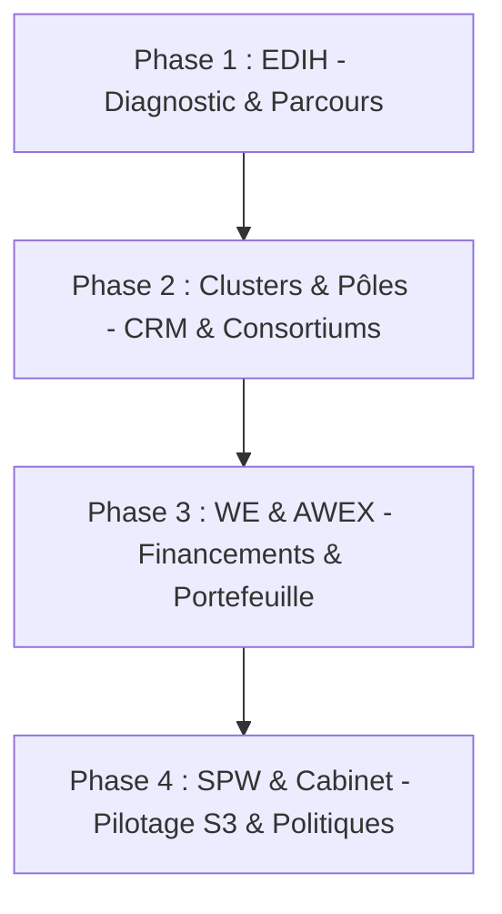

# Stratégie d'Adoption & Déploiement – PIT vNext

Ce document définit la stratégie de déploiement, de positionnement et d'adoption de la **Plateforme d'Intégration Territoriale (PIT) vNext** auprès des opérateurs régionaux, des agences publiques, des pôles de compétitivité, des cabinets ministériels et des entreprises de Wallonie.

---

## PARTIE 1 – POSITIONNEMENT STRATÉGIQUE

La PIT n'est pas un système informatique isolé ; elle agit comme le **Knowledge Graph Territorial de l'innovation wallonne**. Son positionnement s'articule autour de la valeur spécifique qu'elle apporte à chaque type d'opérateur public et privé.

### 1. Pour le SPW (Service Public de Wallonie)
* **Problèmes résolus** : 
  * Dispersion et asymétrie de la donnée sur l'innovation (les données sont éclatées entre pôles, clusters et administrations).
  * Évaluation d'impact des politiques publiques (S3, Digital Wallonia, Circular Wallonia) reposant sur du déclaratif déconnecté de la preuve.
* **Gains majeurs** : 
  * Visualisation en temps réel de l'avancement et de l'impact concret des subventions publiques.
  * Auditabilité des résultats grâce au registre d'**Evidences** (justificatifs administratifs et techniques).
* **Pourquoi remplacer les silos ?** : 
  * Les silos empêchent toute vue consolidée et entraînent des doubles financements involontaires. Centraliser les données sémantiques au sein d'un graphe partagé permet au SPW d'auditer l'efficacité d'un euro investi par rapport aux priorités de la S3.

### 2. Pour WE (Wallonie Entreprendre)
* **Gains majeurs** : 
  * **Vision Portefeuille** : Suivi consolidé des entreprises financées par WE (startups, PMEs, scale-ups) avec leur niveau de maturité numérique, cyber et IA (diagnostic DR-BEST).
  * **Co-investissement & R&D** : Identification des opportunités de financement complémentaire de projets R&D émergeant des pôles de compétitivité.
  * **Mesure d'impact financier** : Lignage entre les enveloppes financières régionales allouées (ex. Capital-risque, subventions) et les résultats métiers quantifiés de l'entreprise.

### 3. Pour l'AWEX (Agence Wallonne à l'Exportation et aux Investissements Étrangers)
* **Gains majeurs** : 
  * **Détection des pépites exportables** : Filtrage intelligent des entreprises du territoire ayant atteint des seuils de maturité élevés et dont les projets d'innovation ont produit des *outcomes* certifiés.
  * **Attractivité territoriale** : Présentation dynamique et visuelle (via le *Graph Explorer*) des chaînes de valeur de pointe (ex. Hydrogène Vert, e-Santé) aux investisseurs étrangers pour démontrer l'excellence et la complétude de l'écosystème industriel wallon.

### 4. Pour les Pôles de Compétitivité (BioWin, GreenWin, MecaTech, Logistics, Wagralim, Skywin)
* **Gains majeurs** : 
  * **Animation & CRM** : Fichier qualifié et partagé des membres, des cercles d'écosystèmes et de leurs verrous technologiques (gaps).
  * **Montage de Consortiums** : Moteur de recommandation sémantique suggérant instantanément les partenaires R&D académiques et industriels optimaux.
  * **Gestion des financements** : Alignement direct des projets labellisés sur les appels à projets ouverts de WE et de l'Europe.

### 5. Pour les Clusters Territoriaux
* **Gains majeurs** : 
  * **Matchmaking** : Connexion en temps réel des défis techniques des membres du cluster avec le catalogue territorial de services.
  * **Animation de Communautés** : Outil d'historisation des interactions, des événements et des contributions des membres.

### 6. Pour les EDIH (European Digital Innovation Hubs)
* **Gains majeurs** : 
  * **Suivi de Parcours** : Utilisation du *Journey Framework* pour guider pas-à-pas les PMEs dans leur transformation numérique (e-Santé, Cyber, IA).
  * **Services & Diagnostics** : Encodage et calcul standardisés de la maturité digitale (diagnostics DR-BEST et DMA européens).
  * **Reporting Européen** : Exportation de données de reporting prêtes pour la Commission européenne, justifiant l'usage des fonds européens.

---

## PARTIE 2 – MESSAGES CLÉS & POSITIONNEMENT DE MARQUE

Le positionnement actuel (« Plateforme d'Intelligence Territoriale ») est perçu comme trop académique et abstrait. Quatre variantes de positionnement ont été comparées :

| Variante de message | Avantages | Inconvénients |
| :--- | :--- | :--- |
| **1. « PIT est le CRM territorial wallon. »** | Analogie immédiate et facile pour les conseillers de terrain. | Réduit la PIT à un carnet d'adresses alors qu'elle modélise les projets, impacts et politiques S3. |
| **2. « PIT relie les entreprises, les services, les financements, les projets et les stratégies régionales. »** | Descriptif, précis, démontre le lignage logique global. | Un peu long, ressemble à une explication technique plutôt qu'à un slogan commercial. |
| **3. « PIT transforme les données opérationnelles en pilotage stratégique. »** | Met l'accent sur le bénéfice décideur (DGs, ministres). | Trop abstrait pour les conseillers de pôle au quotidien. |
| **4. « PIT est le système d'exploitation des écosystèmes wallons. »** | Image forte et moderne (OS) ; exprime la centralisation de tous les modules métiers. | Métaphore technologique qui peut rebuter les profils moins digitaux. |

### Message principal recommandé :
* **Slogan Exécutif (DG / Ministres) :**
  > **« PIT : Le premier cockpit sémantique territorial qui relie l'action opérationnelle locale à l'impact des stratégies publiques régionales. »**
* **Slogan Opérationnel (Opérateurs / Pôles / Entreprises) :**
  > **« PIT connecte les acteurs, les expertises, les financements et les projets wallons dans un réseau unique pour accélérer l'innovation. »**

---

## PARTIE 3 – OBJECTIONS ET RÉPONSES MÉTIERS

### 1. SPW : *« Nous avons déjà des outils comme e-sub ou d'autres bases administratives. »*
* **Réponse** : Les outils actuels gèrent le versement financier et l'instruction administrative des dossiers. Ils ne lient pas la subvention à la dynamique opérationnelle de l'écosystème (consortium, chaînes de valeur, maturité de l'entreprise). La PIT ne remplace pas ces outils ; elle les connecte au graphe sémantique pour mesurer l'impact réel sur le terrain de chaque euro subventionné.

### 2. WE : *« Nous utilisons déjà Salesforce / notre CRM interne pour suivre nos dossiers. »*
* **Réponse** : Salesforce est excellent pour suivre le flux financier interne et la relation client directe de WE. Cependant, il ne capture pas les collaborations R&D multipartenaires, l'intégration des entreprises dans les segments de la chaîne de valeur stratégique des pôles de compétitivité, ou l'alignement sur les roadmaps S3. La PIT s'interface par API avec Salesforce pour y injecter le contexte d'écosystème régional sans double encodage.

### 3. Clusters & Pôles : *« C'est encore un outil supplémentaire dans lequel nous devons encoder. »*
* **Réponse** : Au contraire, la PIT unifie et rationalise les outils des conseillers (CRM, matchmaking, suivi de projet) pour éliminer les copier-coller. Le reporting stratégique demandé par le SPW est généré automatiquement comme un sous-produit naturel des actions opérationnelles courantes dans la PIT.

### 4. EDIH : *« Nous utilisons déjà notre propre application de reporting. »*
* **Réponse** : Les applications EDIH sont des outils de stockage de diagnostics fermés. La PIT connecte ces diagnostics au catalogue global de services de Wallonie et aux aides financières de WE. Elle valorise le travail de l'EDIH en le transformant en opportunité d'accompagnement plus large.

### 5. Entreprises : *« Pourquoi créer un profil de plus sur une plateforme publique ? »*
* **Réponse** : L'entreprise n'encode pas des données pour du reporting passif. Elle accède à un espace personnalisé de recommandations (moteur de match R&D, services adaptés et financements pertinents à ses défis techniques) qui accélère son parcours de croissance.

---

## PARTIE 4 – STRATÉGIE D'ADOPTION DEPLOYABLE

Pour minimiser le risque de rejet, le déploiement de la PIT vNext s'organise en 4 phases progressives basées sur des cas d'usage réels :



* **PHASE 1 : Les EDIH (e-Santé, Cyber, IA)**
  * *Objectif* : Valider le module de diagnostic de maturité (DR-BEST), la délivrance de services et le suivi de parcours d'innovation d'un volume critique d'entreprises.
* **PHASE 2 : Les Pôles & Clusters**
  * *Objectif* : Déployer le CRM d'Écosystème collaboratif, l'assemblage de consortiums multipartenaires et la cartographie des chaînes de valeur territoriales.
* **PHASE 3 : Wallonie Entreprendre & AWEX**
  * *Objectif* : Connecter les portefeuilles financiers de WE et les opportunités d'exportations / investissements internationaux aux projets R&D réussis.
* **PHASE 4 : Le SPW & Cabinets**
  * *Objectif* : Ouvrir le cockpit stratégique exécutif global pour consolider les indicateurs d'impact et piloter la S3 en continu.

---

## PARTIE 5 – LES QUICK WINS OPÉRATIONNELS

Les 10 fonctionnalités clés de la PIT vNext classées selon leur valeur métier, leur facilité d'adoption et leur impact politique :

| Fonctionnalité | Valeur Métier | Facilité d'Adoption | Impact Politique | Priorité d'activation |
| :--- | :---: | :---: | :---: | :---: |
| **1. Graph Explorer** | Moyenne | **Très Élevée** (Lecture) | **Très Élevé** (Effet Wow) | **Immédiate (T0)** |
| **2. Gap Analysis** | **Très Élevée** | Moyenne | Élevé | T+6 mois |
| **3. Value Chain Explorer** | **Très Élevée** | **Très Élevée** | Élevé | **Immédiate (T0)** |
| **4. Story Mode / Demo** | Moyenne | **Très Élevée** | **Très Élevé** | **Immédiate (T0)** |
| **5. Recommender Matcher** | **Très Élevée** | Élevée | Moyen | T+6 mois |
| **6. Workspace Switcher** | Élevée | **Très Élevée** | Moyen | **Immédiate (T0)** |
| **7. Consortium Builder** | **Très Élevée** | Moyenne | Moyen | T+12 mois |
| **8. Evidence Audit Board** | Élevée | Moyenne | Moyen | T+12 mois |
| **9. Strategic Framework** | Élevée | **Très Élevée** | **Très Élevé** | T+18 mois |
| **10. KPI Dashboard DG** | Élevée | **Très Élevée** | **Très Élevé** | T+18 mois |

---

## PARTIE 6 – ANALYSE DES RISQUES D'ADOPTION

| Type de risque | Description | Probabilité | Impact | Plan d'atténuation |
| :--- | :--- | :---: | :---: | :--- |
| **Organisationnel** | Résistance des pôles au partage de données sur "leurs" entreprises membres (peur de la concurrence). | **Élevée** | **Élevé** | Introduction de profils de visibilité : les données opérationnelles fines restent privées, seuls les outcomes partagés et validés remontent au graphe régional. |
| **Politique** | Changement de législature régionale remettant en cause la structure de la S3 ou de Circular Wallonia. | Moyenne | **Élevé** | Le méta-modèle de la PIT est flexible : si les frameworks stratégiques changent, il suffit de re-mapper sémantiquement les indicateurs vers le nouveau programme sans modifier le code. |
| **Métier** | Surcharge d'encodage perçue par les conseillers et animateurs de pôles. | **Élevée** | **Élevé** | Automatisation maximale et interfaçage par API avec les bases existantes (CRM internes). Suppression progressive des rapports Word manuels au profit de la donnée structurée. |
| **Technique** | Problème d'interopérabilité avec les systèmes d'information historiques du SPW ou de WE. | Moyenne | Moyen | Alignement strict sur les standards européens du W3C (modèle CPSV-AP) et formats JSON-LD/RDF facilitant les échanges de données fédérés. |

---

## PARTIE 7 – ROADMAP D'ADOPTION SUR 24 MOIS

```
[T0] ---------------- [T+6M] ---------------- [T+12M] --------------- [T+18M] --------------- [T+24M]
Démonstrateur          EDIH                  Clusters &             WE &                    SPW
PIT vNext              Pilote                Pôles                  AWEX                    S3 Régional
(Acteurs & Gaps)       (Diagnostics PMEs)    (Consortiums)          (Financements)          (Cockpit Global)
```

* **T0 (Lancement)** : Déploiement du démonstrateur avec les 3 récits métiers intégrés et le *Graph Explorer* ouvert aux DGs pour susciter l'intérêt.
* **T+6 mois (Pilote EDIH)** : Intégration complète des EDIH wallons. Calcul de la maturité digitale des 150 premières PMEs accompagnées.
* **T+12 mois (Opérateurs Pôles & Clusters)** : Déploiement du catalogue de services et de l'outil d'assemblage de consortiums auprès de BioWin, GreenWin, MecaTech, Logistics, Wagralim et Skywin.
* **T+18 mois (Fonds & Export)** : Connexion des bases de données de Wallonie Entreprendre (aides financières) et de l'AWEX (détection de cibles d'exportation).
* **T+24 mois (Généralisation SPW)** : Transition complète du pilotage des politiques S3, Digital Wallonia et Circular Wallonia sur le cockpit stratégique de la PIT.

---

## PARTIE 8 – DECISION MAKER PACK (DG & MINISTRES)

### Pourquoi la PIT ?
Aujourd'hui, la Wallonie investit des centaines de millions d'euros par an dans la recherche, le développement et le soutien aux entreprises. Pourtant, **aucun décideur n'a de visibilité transverse en temps réel** sur l'efficacité de ces financements. Nous pilotons l'innovation territoriale avec des rapports Word statiques trimestriels et des feuilles Excel incompatibles. La PIT unifie ces informations dans un **Knowledge Graph Territorial unique**, certifié par des justificatifs d'impact audités.

### Pourquoi maintenant ?
L'obligation européenne de se conformer à la directive NIS2 et les exigences de reporting de la Commission européenne (pour les EDIH et le FEDER) forcent nos opérateurs à numériser leurs parcours. Attendre, c'est risquer une perte de financements européens et accroître la fracture numérique de nos PMEs. La PIT vNext est prête, stable techniquement, et testée avec succès sur des cas réels (e-Santé, Hydrogène, Cybersécurité).

### Combien coûte l'absence de PIT ?
* **Double subventionnement involontaire** d'entreprises sur des projets identiques par manque de partage d'informations entre opérateurs (estimé à 3-5% des budgets de R&D régionaux).
* **Temps perdu à compiler** des tableaux Excel manuels pour les rapports de performance (des milliers d'heures de conseillers par an).
* **Incapacité à identifier et corriger les "gaps" industriels** (segments de chaînes de valeur orphelins comme la validation réglementaire clinique ou le stockage hydrogène), ce qui freine le déploiement commercial de nos innovations.

### Quels bénéfices concrets ?
* **Pour la Région Wallonne (SPW & Cabinet) :** Un pilotage stratégique automatisé et auditable, assurant que l'argent public finance des résultats concrets reliés aux priorités régionales S3.
* **Pour les entreprises :** Un guichet unique intelligent de recommandation qui leur suggère en 10 secondes le partenaire R&D idéal, le service public requis et l'aide financière active.
* **Pour les opérateurs (Pôles, Clusters, EDIH) :** Un outil d'animation d'écosystème performant qui valorise leur action et simplifie à l'extrême leurs obligations de reporting administratif.
