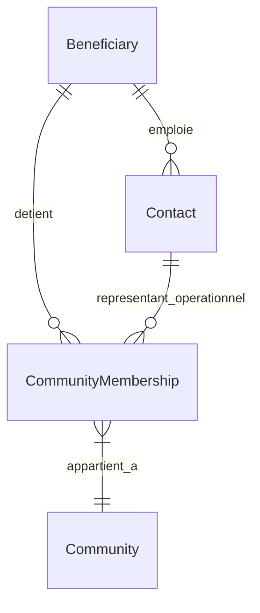

# Audit de Couverture CRUD Opérationnelle — PIT vNext

Ce document présente l'audit rigoureux de la maturité opérationnelle de la **Plateforme d'Intelligence Territoriale (PIT) vNext**. L'objectif est d'identifier précisément ce qu'un conseiller d'accompagnement ou un animateur d'écosystème (BioWin, GreenWin, Logistics, EDIH, etc.) peut réellement encoder, modifier ou supprimer au quotidien, en contrastant les capacités de la base de données, des API et de l'interface utilisateur (Next.js).

---

## PARTIE 1 – MATRICE DE COUVERTURE CRUD

Ce tableau récapitule la disponibilité fonctionnelle de chaque concept sémantique de la PIT à tous les niveaux de l'architecture.

| Objet Métier | Explorer (UI) | Create (UI) | Read (UI) | Update (UI) | Delete (UI) | Workflow Métier | API (Endpoints) | DB (Prisma) | Graph (Visual) |
| :--- | :---: | :---: | :---: | :---: | :---: | :---: | :---: | :---: | :---: |
| **Beneficiary** | **OK** | **MANQUANT** | **OK** | **MANQUANT** | **MANQUANT** | OK (Scoring DMAT/Export) | OK (v1/v2 API) | OK (`Beneficiary`) | OK (Nœud Jaune) |
| **Contact** | **MANQUANT** | **MANQUANT** | **MANQUANT** | **MANQUANT** | **MANQUANT** | MANQUANT | **MANQUANT** | **MANQUANT** | **MANQUANT** |
| **Membership** | **PARTIEL** | **MANQUANT** | **OK** | **MANQUANT** | **MANQUANT** | MANQUANT | OK (v2 API) | OK (`CommunityMembership`) | PARTIEL (Relations) |
| **Community** | **OK** | **MANQUANT** | **OK** | **MANQUANT** | **MANQUANT** | OK (Matchmaking/Consortium) | OK (v2 API) | OK (`Community`) | OK (Nœud Violet) |
| **CommunityMembership**| **PARTIEL** | **MANQUANT** | **OK** | **MANQUANT** | **MANQUANT** | MANQUANT | OK (v2 API) | OK (`CommunityMembership`) | PARTIEL (Relations) |
| **Activity** | **OK** | **PARTIEL** | **OK** | **MANQUANT** | **MANQUANT** | OK (Conversions SoE) | OK (v2 API) | OK (`Activity`) | OK (Nœud Violet) |
| **Participation** | **MANQUANT** | **PARTIEL** | **OK** | **MANQUANT** | **MANQUANT** | MANQUANT | OK (v2 API) | OK (`MemberParticipation`) | No |
| **Attendance** | **MANQUANT** | **PARTIEL** | **OK** | **MANQUANT** | **MANQUANT** | MANQUANT | OK (v2 API) | **PARTIEL** (Stored in JSON notes) | No |
| **Challenge** | **OK** | **OK** | **OK** | **OK** | **OK** | OK (S3 Alignments) | OK (v2 API) | OK (`Challenge`) | OK (Nœud Violet) |
| **EcosystemChallenge** | **OK** | **OK** | **OK** | **OK** | **OK** | OK (S3 Alignments) | OK (v2 API) | OK (`Challenge`) | OK (Nœud Violet) |
| **Journey** | **OK** | **OK** | **OK** | **OK** | **OK** | OK (Maturity Roadmap) | OK (v2 API) | OK (`Journey`) | OK (Nœud Violet) |
| **JourneyInstance** | **MANQUANT** | **OK** | **OK** | **OK** | **OK** | OK (Step Tracker) | OK (v2 API) | OK (`JourneyInstance`) | No |
| **Service CPSV** | **OK** | **OK** | **OK** | **OK** | **OK** | OK (CPSV-AP Core Specs) | OK (v1/v2 API) | OK (`PublicService`) | OK (Nœud Violet) |
| **Opportunity** | **OK** | **MANQUANT** | **OK** | **MANQUANT** | **MANQUANT** | OK (Matchmaking / Consortium) | OK (v2 API) | OK (`Opportunity`) | OK (Nœud Vert) |
| **Funding** | **OK** | **MANQUANT** | **OK** | **MANQUANT** | **MANQUANT** | OK (Connecteur BCE/WE) | OK (v1/v2 API) | OK (`FundingInstrument`) | OK (Nœud Vert) |
| **FundingProgram** | **MANQUANT** | **MANQUANT** | **MANQUANT** | **MANQUANT** | **MANQUANT** | MANQUANT | **MANQUANT** | OK (`FundingProgram`) | No |
| **FundingCall** | **MANQUANT** | **MANQUANT** | **MANQUANT** | **MANQUANT** | **MANQUANT** | MANQUANT | **MANQUANT** | OK (`FundingCall`) | No |
| **Consortium** | **OK** | **OK** | **OK** | **OK** | **OK** | OK (Constitution rapide) | OK (v2 API) | OK (`Consortium`) | OK (Nœud Vert) |
| **Project** | **PARTIEL** | **OK** | **OK** | **OK** | **OK** | OK (Impact Tracking) | OK (v2 API) | OK (`Project`) | OK (Nœud Vert) |
| **Outcome** | **PARTIEL** | **OK** | **OK** | **OK** | **OK** | OK (Strategic Alignment) | OK (v2 API) | OK (`Outcome`) | OK (Nœud Violet) |
| **Evidence** | **PARTIEL** | **OK** | **OK** | **OK** | **OK** | OK (Submissions) | OK (v2 API) | OK (`Evidence`) | OK (Nœud Violet) |
| **EvidenceAudit** | **OK** | N/A | **OK** | **OK** | N/A | OK (Steward Validation Flow) | OK (v2 API) | PARTIEL (Evidence Status) | No |
| **Program** | **OK** | **OK** | **OK** | **MANQUANT** | **MANQUANT** | OK (Participations) | OK (v1/v2 API) | OK (`Program`) | OK (Nœud Violet) |
| **Priority** | **OK** | **MANQUANT** | **OK** | **MANQUANT** | **MANQUANT** | OK (Strategic Cascade) | OK (v1 API) | OK (`StrategicPriority`) | OK (Nœud Violet) |
| **Initiative** | **OK** | **OK** | **OK** | **MANQUANT** | **MANQUANT** | OK (Participations) | OK (v1/v2 API) | OK (`Initiative`) | OK (Nœud Violet) |
| **Action** | **MANQUANT** | **MANQUANT** | **OK** | **MANQUANT** | **MANQUANT** | OK (Priority-Activity Link) | OK (v2 API) | OK (`Action`) | OK (Nœud Violet) |
| **Data Product** | **OK** | **OK** | **OK** | **MANQUANT** | **MANQUANT** | OK (Subscription request) | OK (v2 API) | PARTIEL (JSON file) | OK (Nœud Jaune) |
| **Source System** | **OK** | **OK** | **OK** | **MANQUANT** | **MANQUANT** | OK (Sync status) | OK (v2 API) | PARTIEL (JSON file) | OK (Nœud Jaune) |
| **Taxonomy Registry** | **MANQUANT** | **MANQUANT** | **MANQUANT** | **MANQUANT** | **MANQUANT** | MANQUANT | OK (v2 API) | No | No |

---

## PARTIE 2 – BENEFICIARY / MEMBER / PARTNER / CONTACT

### Analyse de la structure actuelle du modèle de données
Dans la base de données actuelle (Prisma schema), les relations de membre sont organisées de la manière suivante :
- Le concept de **Membership** (`CommunityMembership`) est porté exclusivement par l'entité **`Member`**.
- L'entité **`Member`** est un objet hybride représentant :
  - Soit un acteur R&D / Université / Organisme de support (type: "Université", "Centre de recherche", "Expert", "Institution publique").
  - Soit une entreprise (`type: "Entreprise"`), auquel cas elle pointe optionnellement vers un **`Beneficiary`** (`beneficiaryId Int? @unique`).
  - Elle possède également un `organizationId` pour pointer vers une `Organization` (Opérateur).
- Le concept de **Contact** n'a pas de table dédiée. Les adresses e-mail et téléphones sont stockés directement sur l'entité `Member` (par exemple, pour représenter un expert individuel).

### Alignement avec la Règle Cible
La règle d'or métier de la PIT attendue est :
1. **`Beneficiary`** (l'entreprise morale disposant d'un numéro BCE) porte le **`Membership`** aux cercles de compétitivité (BioWin, GreenWin, etc.).
2. Le **`Contact`** (l'individu physique) est rattaché au `Beneficiary` et porte un rôle opérationnel de communication/technique, mais ne détient pas le membership.

**Diagnostic de respect : NON RESPECTÉ**
- La structure actuelle lie le membership à `Member`. Si un conseiller souhaite lier une entreprise à BioWin, il doit créer un `Member` (qui encapsule les métadonnées de l'entreprise), puis le lier à la `Community` via `CommunityMembership`.
- Le `Beneficiary` est un objet isolé qui ne possède aucune relation directe avec les `CommunityMembership`.

### Correction architecture proposée (pour itération future)

* **Modification du Schéma** :
  - Redéfinir `CommunityMembership` pour référencer `beneficiaryId` au lieu de `memberId`.
  - Créer un modèle `Contact` (id, name, email, phone, role, beneficiaryId).

---

## PARTIE 3 – COMMUNITIES (CERCLES D'ÉCOSYSTÈMES)

* **Création et Édition de la Communauté (Community)** :
  - **API** : Les endpoints `POST /api/v2/communities`, `PUT /api/v2/communities/:id` et `DELETE /api/v2/communities/:id` sont fonctionnels et gèrent parfaitement l'écriture en base de données.
  - **Interface utilisateur** : **MANQUANT**. L'interface `/communities` affiche uniquement les communautés sémantiques et leur détail. Il n'existe aucun formulaire pour créer un cercle sémantique ou modifier ses détails.
* **Gestion des membres au sein du cercle** :
  - **API** : Les endpoints `/api/v2/community-memberships` gèrent l'ajout, la modification (rôle) et la suppression.
  - **Interface utilisateur** : **MANQUANT**. L'onglet "Membres & Rôles" est en lecture seule. Un animateur de pôle ne peut pas ajouter une entreprise à son cercle ou changer son statut ("ACTIVE"/"INACTIVE") depuis l'interface.

---

## PARTIE 4 – MEMBERSHIP (ADHÉSIONS)

* **CRUD Opérationnel de Membership** :
  - **API** : OK via les routes d'écriture de `CommunityMembership`.
  - **Interface utilisateur** : **MANQUANT**. Il n'existe pas d'écran de gestion des adhésions. Les requêtes de modification et de suppression ne sont pas implémentées dans le frontend.
* **Représentations métier** :
  - La base de données peut représenter sans problème un membre BioWin ou GreenWin (via `Community` et `CommunityMembership` associés), ainsi qu'un membre de consortium (via `ConsortiumMember`).
  - Cependant, le conseiller ne dispose d'aucun moyen pour clôturer ou modifier le rôle opérationnel d'un membre à l'écran.

---

## PARTIE 5 – ECOSYSTEM CHALLENGES (DÉFIS D'ÉCOSYSTÈMES)

* **Distinction Challenge Individuel vs Défi d'Écosystème** :
  - **Oui, la distinction existe en base de données** :
    - **`BusinessChallenge`** (individuel) : Représente les verrous spécifiques d'une entreprise (ex: "Cherche ERP logistique"), lié directement à un `Beneficiary` et listé dans sa cascade Beneficiary 360.
    - **`Challenge`** (écosystème) : Représente un défi sectoriel territorial macro (ex: "Manque de compétences en computer vision"), lié aux filières S3, aux dimensions de capacité R&D, et aux cercles de membres.
  - **UI** : L'Espace `/challenges` gère l'écriture et l'édition des défis d'écosystème (macro). Les défis individuels sont modifiés indirectement via le workspace conseiller.

---

## PARTIE 6 – EVIDENCE AUDIT (AUDIT DES PREUVES)

* **Workflow d'approbation opérationnel** :
  - **Interface utilisateur** : **OK** via la page dédiée `/evidences`. Un Data Steward ou Animateur en chef peut cliquer pour approuver (`APPROVED`) ou rejeter (`REJECTED`) une preuve d'impact soumise.
  - **API** : Enregistrement réactif en DB via `PATCH /api/v2/strategic/evidences/:id/status`.
* **Gaps identifiés dans le workflow** :
  - **Commentaires & Corrections** : **MANQUANT**. Il est impossible de saisir un motif de rejet ou des recommandations de correction. Le rejet est binaire.
  - **Historique & Traçabilité** : **MANQUANT**. L'identité de l'auditeur et l'historique des changements de statut ne sont pas conservés (pas de table de log d'audit).

---

## PARTIE 7 – FUNDING (FINANCEMENTS & OPPORTUNITÉS)

* **CRUD Opérationnel** :
  - **Interface utilisateur** : **MANQUANT**. L'Opportunity Explorer (`/opportunities`) affiche les opportunités CRM et les budgets associés en lecture seule. Un animateur ne peut pas ajouter un nouvel appel à projet, ni modifier les dates limites de soumission.
  - **API** : Seuls les endpoints `GET` et `POST` sont configurés pour `opportunities`, mais les mutations de modification (`PUT`) et de suppression (`DELETE`) de financements ne sont pas appelées par l'interface.
* **Programmes vs Appels** :
  - Bien que `FundingProgram` et `FundingCall` existent dans le schéma Prisma, **ils sont totalement absents de la couche API (server.ts) et du frontend**. Seul le modèle générique `FundingInstrument` est exploité sous la dénomination fonctionnelle d'opportunités.
* **Associations** :
  - L'association d'un financement à une entreprise se fait de manière unilatérale lors d'une conversion d'activité ("Convertir en Financement"). Il n'y a pas d'écran d'édition global pour lier des consortiums à des financements dans l'interface.

---

## PARTIE 8 – TEST DE CHAINE COMPLETE (PÉRISSABLE)

Scénario opérationnel complet pour un animateur de pôle :

1. **Créer un bénéficiaire (Entreprise)** : ❌ **MANQUANT** (Pas de formulaire d'encodage de PME).
2. **Ajouter un contact à cette entreprise** : ❌ **MANQUANT** (Pas de modèle `Contact` ni de formulaire).
3. **Ajouter un membership (Associer au pôle)** : ❌ **MANQUANT** (Interface lecture seule).
4. **Créer une communauté sémantique** : ❌ **MANQUANT** (Interface lecture seule).
5. **Créer un défi d'écosystème (S3)** : 📑 **OK** (Formulaire disponible dans `/challenges`).
6. **Créer une activité (Animation)** : ⚠️ **PARTIEL** (On peut créer des ateliers collectifs ou des missions de structure via formulaire, mais l'écriture se fait dans les anciennes tables `CollectiveDelivery` / `SecondLineMission` au lieu de la table unifiée `Activity`).
7. **Ajouter des participants à l'activité** : ⚠️ **PARTIEL** (Sélection des entreprises possible uniquement lors de la soumission initiale du formulaire, pas de modification ultérieure).
8. **Convertir vers un parcours** : 📑 **OK** (Action de conversion fonctionnelle dans le panneau latéral).
9. **Associer un service public (CPSV)** : 📑 **OK** (Action de conversion sémantique active).
10. **Associer une opportunité d'innovation** : 📑 **OK** (Système de qualification active dans `/opportunities`).
11. **Associer un financement** : 📑 **OK** (Action de conversion sémantique active).
12. **Créer un consortium de partenaires** : 📑 **OK** (Interface de constitution de consortium fonctionnelle dans `/consortia`).
13. **Créer un projet d'innovation** : 📑 **OK** (Formulaire de création de projet disponible dans le cockpit `/strategic`).
14. **Créer un outcome (Impact)** : 📑 **OK** (Formulaire disponible dans le cockpit `/strategic`).
15. **Soumettre une evidence (Preuve)** : 📑 **OK** (Formulaire disponible dans le cockpit `/strategic`).
16. **Faire approuver l'evidence** : 📑 **OK** (Workflow d'audit de statut fonctionnel dans `/evidences`).
17. **Visualiser le résultat interconnecté dans les 5 dashboards** : 📑 **OK** (La cascade de lignage 360°, le Graph Explorer et le cockpit DG répercutent bien les relations si les données sont correctement écrites en base).

---

## PARTIE 9 – PRIORITES DE DEVELOPPEMENT

Pour transformer la PIT de démonstrateur sémantique en outil métier indispensable pour les pôles de compétitivité (BioWin, GreenWin, MecaTech) et les agences (WE, AWEX, SPW), voici la classification des écarts à combler :

### 🚨 1. CRITIQUE (Bloquant pour déploiement pilote)
* **CRUD Bénéficiaires / Entreprises (UI)** :
  * *Problème* : Un conseiller ne peut pas enregistrer une nouvelle entreprise (PME/Startup) rencontrée sur le terrain.
  * *Action* : Créer un formulaire simple "Ajouter une Entreprise" dans `/beneficiaries` branché sur le `POST /api/beneficiaries` existant.
* **Unification de la création d'Activité** :
  * *Problème* : L'interface d'animation crée des entités obsolètes (`CollectiveDelivery`) qui n'alimentent pas la table unifiée `Activity`.
  * *Action* : Faire pointer les formulaires de création d'ateliers collectifs directement vers le `POST /api/v2/activities` (avec le bon `ActivityType`).
* **Gestion des Membres de Communautés (UI)** :
  * *Problème* : Impossible d'ajouter ou de retirer une entreprise d'une communauté sectorielle ou d'un cluster.
  * *Action* : Ajouter les boutons d'ajout/retrait de membres dans l'onglet "Membres & Rôles" branchés sur les routes `/api/v2/community-memberships`.

### ⚠️ 2. IMPORTANT (Nécessaire sous 3 mois)
* **Création d'Opportunités et Appels S3 (UI)** :
  * *Problème* : Les animateurs ne peuvent pas encoder les nouveaux appels à projets wallons qui s'ouvrent.
  * *Action* : Ajouter un formulaire de création d'Opportunités dans `/opportunities`.
* **Modélisation de l'entité Contact** :
  * *Problème* : Impossible d'identifier l'interlocuteur physique (CTO, CEO) au sein de la PME.
  * *Action* : Intégrer un modèle `Contact` lié à `Beneficiary` et ajouter un widget de contacts dans le Beneficiary 360.
* **CRUD des Politiques Publiques (UI)** :
  * *Problème* : Impossible de modifier ou de supprimer des programmes ou initiatives obsolètes.
  * *Action* : Ajouter les actions d'édition/suppression dans la vue `/strategies` en réutilisant les endpoints de modification backend existants.

### 💡 3. CONFORT (Améliorations post-pilote)
* **Commentaires d'Audit de Preuve** :
  * *Problème* : Un rejet de preuve d'impact sans explication frustre l'opérateur.
  * *Action* : Ajouter un champ texte "Motif de rejet/correction" lors du clic sur le bouton rejeter dans la page `/evidences`.
* **Interface du Taxonomy Registry** :
  * *Problème* : L'alignement des taxonomies de codes NACE et de domaines technologiques reste purement programmatique.
  * *Action* : Construire une page d'administration simple pour mapper visuellement des concepts externes vers le Knowledge Graph.
