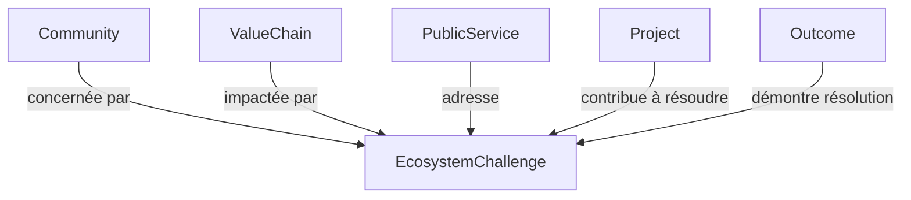

# Modèle Métier — Défi d'Écosystème (EcosystemChallenge)

Ce document décrit le modèle métier unifié pour la gestion des verrous et défis d'écosystèmes régionaux au sein de la PIT Wallonie (vNext).

## 1. Contexte & Problématique

Jusqu'alors, la PIT permettait de qualifier des verrous d'affaires individuels via le modèle `Challenge` (ou `BusinessChallenge` déprécié). Cependant, les pôles de compétitivité (**BioWin**, **GreenWin**, **Wagralim**, **Logistics**, **MecaTech**) et les programmes transversaux (**EDIH**, **WE**, **AWEX**) opèrent à l'échelle d'écosystèmes entiers.

Les défis d'écosystème correspondent à des problématiques collectives et structurelles :
* Manque de compétences ciblées (ex: experts en IA santé pour BioWin).
* Pénurie d'infrastructures (ex: stations de stockage hydrogène pour GreenWin).
* Retards de maturité numérique collectifs (ex: faible digitalisation des PME industrielles pour EDIH).
* Manques de capitaux ciblés (ex: absence de fonds d'investissement DeepTech pour Wallonie Entreprendre).

Le modèle `EcosystemChallenge` permet d'identifier ces verrous, de les prioriser, de mesurer leur impact territorial et de suivre la contribution des services publics et des consortiums de R&D à leur résolution.

---

## 2. Structure du Modèle (Attributs)

Chaque défi d'écosystème possède les attributs suivants :

| Attribut | Type | Description |
| :--- | :--- | :--- |
| **Title** | String | Titre clair et mémorable du défi. |
| **Description** | Text | Description complète de la nature du verrou. |
| **Type** | String | Typologie du défi (`COMPETENCY`, `INFRASTRUCTURE`, `FUNDING`, `DIGITAL_MATURITY`, `EXPORT`, `REGULATION`, `OTHER`). |
| **Status** | String | État d'avancement (`ACTIVE`, `RESOLVED`, `ARCHIVED`). |
| **Priority** | String | Niveau de priorité (`HIGH`, `MEDIUM`, `LOW`). |
| **Impact** | Text | Description qualitative ou indicateurs mesurant la gravité de l'impact. |
| **Territory** | String | Couverture géographique concernée (ex: "Wallonie", "Bassin de Liège"). |

---

## 3. Alignement Sémantique & Relations du Graphe

L'objet `EcosystemChallenge` est un nœud de premier niveau dans le **Knowledge Graph Territorial**. Il possède les arêtes (relations) suivantes :

* **Community** (`concernée par`) : Les cercles d'animation thématiques (ex: *IA Santé* pour BioWin) directement pénalisés par le défi.
* **ValueChain / Filiere** (`impactée par`) : Les chaînes de valeur de la S3 (ex: *Hydrogène Vert* ou *Santé Numérique*) dont le déploiement est ralenti.
* **PublicService** (`adresse`) : Les services d'accompagnement (ex: Diagnostics ou Accélérateurs) conçus pour débloquer la situation.
* **Project** (`contribue à résoudre`) : Les initiatives collaboratives de R&D et d'innovation (ex: Projets consortiums).
* **Outcome** (`démontre résolution`) : Les résultats tangibles et mesurables constatés sur le terrain.
