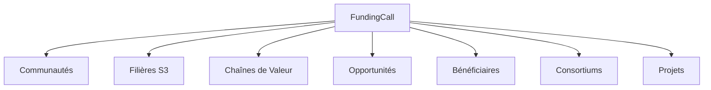

# Modèle Métier — Funding Framework (Programmes & Financements)

Ce document décrit le modèle métier unifié pour la hiérarchie des financements et aides publiques de la PIT Wallonie (vNext).

## 1. Contexte & Problématique

Pour les financeurs publics (**Wallonie Entreprendre - WE**, **SPW**, **AWEX**), la gestion des financements ne peut se limiter à une liste plate d'instruments. Il est essentiel de comprendre l'origine des fonds, les règles d'éligibilité territoriales, les consortiums mobilisés, et l'efficacité finale des aides octroyées.

Le **Funding Framework** de la PIT structure les aides publiques de manière hiérarchique pour assurer une traçabilité complète de l'impact financier.

---

## 2. Hiérarchie Fonctionnelle

Le Funding Framework s'articule autour d'une cascade à 4 niveaux :

```
FundingProgram (Programme)
       ↓
  FundingCall (Appel à Projets)
       ↓
 FundingInstrument (Instrument)
       ↓
   FundingAward (Octroi réel)
```

### Niveaux de la Hiérarchie

1. **FundingProgram (Programme de Financement)**
   * Représente la ligne budgétaire ou la politique cadre à long terme.
   * *Exemples* : "Digital Wallonia", "FEDER Wallonie 2021-2027", "Innovation Fund".
2. **FundingCall (Appel à Projets)**
   * Représente la fenêtre temporelle et thématique d'ouverture des candidatures.
   * *Exemples* : "Tremplin IA 2026", "Transformation Numérique des PME", "Appel Hydrogène S3".
3. **FundingInstrument (Instrument de Financement)**
   * Représente le mécanisme juridique ou financier utilisé.
   * *Exemples* : "Subvention", "Chèque Entreprises Cybersécurité", "Prêt subordonné", "Prise de participation".
4. **FundingAward (Octroi / Financement Obtenu)**
   * Représente l'attribution effective d'un montant à un bénéficiaire ou un consortium.
   * *Exemples* : "50 000 € attribués à MedTech Namur", "250 000 € pour le projet HydroScale".

---

## 3. Modèle de Données & Relations sémantiques

Afin de maximiser la valeur stratégique du graphe, l'objet **FundingCall** sert de pivot pour relier les aides financières aux réalités opérationnelles du territoire.

### Relations du FundingCall



* **Communautés concernées** : Les collectifs d'acteurs ciblés (ex: *IA Santé*).
* **Filières & Chaînes de valeur** : Les secteurs S3 éligibles (ex: *Chimie & Matériaux*).
* **Bénéficiaires & Consortiums** : Les entreprises individuelles ou groupes d'acteurs qualifiés ou financés.
* **Projets** : Les projets de R&D nés grâce à l'appel.
