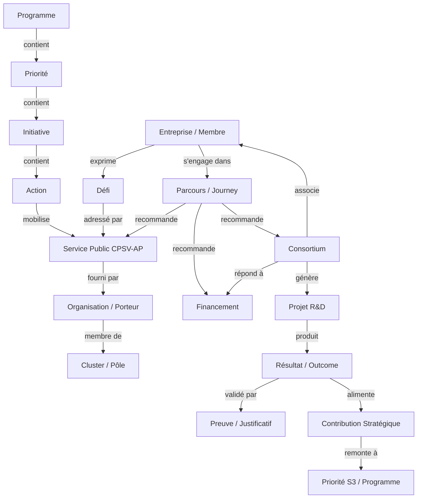

# Spécifications du Knowledge Graph Territorial – PIT vNext

Ce document décrit le modèle conceptuel, les règles de création de nœuds et de relations, ainsi que le mécanisme de propagation automatique des modifications CRUD vers le **Graph Explorer** de la PIT vNext.

---

## 🌐 1. Modèle Conceptuel Sémantique Complet

Le graphe territorial connecte l'ensemble des objets métiers de la PIT dans une ontologie sémantique unifiée :

---

## 🛠️ 2. Règles de Création des Nœuds & Relations

Toute opération d'écriture (POST/PUT/DELETE) dans la base de données relationnelle alimente et structure dynamiquement le Knowledge Graph.

### Règle 1 : Matérialisation des Nœuds (Node Materialization)
* Chaque enregistrement dans une table métier (ex. `Member`, `Challenge`, `PublicService`, `Project`, `Evidence`) équivaut à la création d'un nœud dans le graphe.
* Le nœud possède une **URI unique** (identifiant sémantique W3C standard) structurée sous la forme :  
  `https://pit.wallonie.be/id/{concept}/{id}`  
  *(ex. `https://pit.wallonie.be/id/member/45`, `https://pit.wallonie.be/id/service/srv-ia-diag`)*.

### Règle 2 : Création des Relations Sémantiques (Relationships)
Les relations sont matérialisées par des liaisons clés étrangères et des tables de relations de la base de données.
* **Liaison Défi-Service** : La table de jointure ou la relation `ServiceChallenges` crée le lien `Challenge ➔ adressé par ➔ Service`.
* **Liaison Consortium-Membres** : `ConsortiumMember` crée le lien `Consortium ➔ associe ➔ Member` avec le rôle associé (ex. Lead Partner).
* **Liaison Outcome-Preuve** : Le champ `Evidence.serviceDeliveryId` ou `activityId` lie le résultat mesuré à son justificatif physique approuvé.

---

## 📊 3. Propagation Dynamique dans le Graph Explorer

Le **Graph Explorer** (`/app/graph-explorer`) utilise `@xyflow/react` pour afficher visuellement le graphe de connaissances.

### Algorithme de Chargement et Propagation :
1. **Requête API** : L'explorateur appelle le endpoint `GET /api/v2/graph/{entityType}/{id}`.
2. **Résolution Sémantique** : L'API résout les relations directes de l'objet dans la base de données (ex. pour un projet : son consortium, son financement, sa filière, ses outcomes, ses evidences et ses priorités S3).
3. **Génération de Nœuds et Liens Flow** :
   * L'API renvoie un tableau de nœuds (`nodes`) et de liens (`edges`).
   * Chaque type de nœud se voit attribuer sa couleur correspondante du thème (ex. Fuchsia pour les entreprises, Indigo pour les services, Vert pour les opportunités).
4. **Mise à jour Réactive** :
   * Lorsqu'un utilisateur crée un consortium ou ajoute une preuve dans le back-office CRUD, la mutation React Query invalide le cache de la clé `['v2-graph']` et `['graph']`.
   * L'explorateur de graphe recharge instantanément les données et affiche le nouveau lien animé sur le canevas sans rechargement de page.
